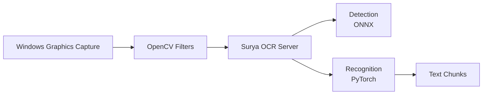
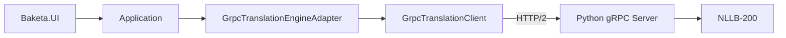

# Baketa

[](https://github.com/koizumiiiii/Baketa/actions/workflows/ci.yml)
[](https://github.com/koizumiiiii/Baketa/actions/workflows/codeql.yml)
[](https://github.com/koizumiiiii/Baketa/releases/latest)
[](https://opensource.org/licenses/MIT)
[](https://dotnet.microsoft.com/download/dotnet/8.0)

**Baketa（バケタ）** は、ゲーム画面のテキストをリアルタイムで翻訳し、透過オーバーレイとして表示するWindows専用アプリケーションです。

## 主要機能

| カテゴリ | 機能 |
|---------|------|
| **OCR** | Surya OCR (ONNX Detection + PyTorch Recognition)、Windows Graphics Capture API |
| **翻訳** | 標準翻訳 (NLLB-200ローカル)、EX翻訳 (高精度クラウド)、gRPC通信 |
| **ROI Manager** | ゲーム別テキスト位置調整、動的閾値制御、部分OCR最適化 |
| **統合AIサーバー** | OCR+翻訳を単一プロセスで実行、VRAM 50%削減 |
| **UI** | Avalonia + ReactiveUI、透過オーバーレイ、ダーク/ライトテーマ |
| **認証** | Supabase Auth (OAuth対応)、Patreon連携 |

### ROI Manager（自動調整機能）

ゲーム画面のテキスト出現位置を**自動調整**し、OCR処理を最適化する目玉機能です。

```
調整前: 全画面OCR (~6秒)  →  調整後: 変化領域のみOCR (<1秒)
```

- **ヒートマップ最適化**: 16x16グリッドでテキスト頻出位置を記録
- **動的閾値制御**: 頻出領域は厳格に、背景領域は緩和して検出
- **ゲーム別プロファイル**: 実行ファイルごとに調整データを自動保存
- **部分OCR実行**: 変化した領域のみを処理し、処理時間を大幅短縮

## クイックスタート

### エンドユーザー向け

1. [最新リリース](https://github.com/koizumiiiii/Baketa/releases/latest)からZIPをダウンロード
2. 任意のフォルダに展開
3. `Baketa.exe` を実行

### 開発者向け

```bash
# クローン
git clone https://github.com/koizumiiiii/Baketa.git
cd Baketa

# ビルド
dotnet build

# テスト実行
dotnet test

# アプリ起動
dotnet run --project Baketa.UI
```

**詳細な開発環境セットアップは [CLAUDE.md](CLAUDE.md) を参照してください。**

## アーキテクチャ

5層クリーンアーキテクチャを採用：

```
Baketa.UI (Avalonia)
    ↓
Baketa.Application (ビジネスロジック)
    ↓
Baketa.Infrastructure / Baketa.Infrastructure.Platform
    ↓
Baketa.Core (抽象化・イベント)
```

### OCR処理フロー



- **キャプチャ**: Windows Graphics Capture API (C++/WinRT)
- **前処理**: OpenCV モルフォロジー・ガウシアンフィルタ
- **OCR**: Surya OCR (gRPC、GPU/CUDA対応)

### gRPC翻訳システム



- **プロトコル**: HTTP/2 (gRPC)、ポート 50051
- **モデル**: NLLB-200-distilled-600M (CTranslate2 int8量子化、~1GB)
- **最適化**: CTranslate2 + int8量子化 (メモリ80%削減)

## システム要件

| 項目 | 最低要件 | 推奨要件 |
|------|----------|----------|
| **OS** | Windows 10 (64-bit) | Windows 11 (64-bit) |
| **CPU** | 4コア以上 | 6コア以上 |
| **RAM** | 8GB | 16GB以上 |
| **GPU VRAM** | 4GB | 6GB以上 |
| **ストレージ** | 10GB | 20GB以上 |

> **Note**: CUDA対応GPU（NVIDIA GeForce GTX 1060以上）があると、OCR処理が約59倍高速化されます。
> 起動時にハードウェアチェックが実行され、要件を満たさない場合は警告が表示されます。

## プロジェクト構成

```
Baketa/
├── Baketa.Core/                 # コア機能・抽象化
├── Baketa.Infrastructure/       # OCR・翻訳エンジン
├── Baketa.Infrastructure.Platform/ # Windows専用実装
├── Baketa.Application/          # ビジネスロジック
├── Baketa.UI/                   # Avalonia UI
├── BaketaCaptureNative/         # C++/WinRT ネイティブDLL
├── grpc_server/                 # Python翻訳サーバー
├── tests/                       # テスト (2,100+ケース)
└── docs/                        # ドキュメント
```

## ドキュメント

- **[docs/README.md](docs/README.md)** - ドキュメントインデックス
- **[CLAUDE.md](CLAUDE.md)** - 開発ガイド・コーディング規約

## コントリビューション

1. [Issues](https://github.com/koizumiiiii/Baketa/issues)で課題を確認
2. リポジトリをフォーク
3. クリーンアーキテクチャとコーディング規約に従って実装
4. テストを追加・実行
5. プルリクエストを作成

### コーディング規約

- C# 12 最新機能を活用
- クリーンアーキテクチャの依存関係を厳守
- 新機能にはテストコードを必須で追加
- `ConfigureAwait(false)` をライブラリコードで使用

## ライセンス

[MIT License](LICENSE)

## 謝辞

- [Surya OCR](https://github.com/VikParuchuri/surya) - テキスト検出・認識
- [Meta NLLB-200](https://github.com/facebookresearch/fairseq/tree/nllb) - 多言語翻訳
- [Avalonia](https://avaloniaui.net/) - UIフレームワーク
- [OpenCV](https://opencv.org/) - 画像処理

---

**Baketa** - ゲーム翻訳をもっと身近に
