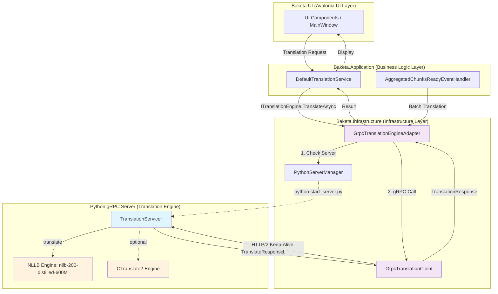

# Baketa

[](https://github.com/koizumiiiii/Baketa/actions/workflows/ci.yml)
[](https://github.com/koizumiiiii/Baketa/actions/workflows/codeql.yml)
[](https://opensource.org/licenses/MIT)
[](https://dotnet.microsoft.com/download/dotnet/8.0)
[](https://www.microsoft.com/windows)

Baketa（バケタ）は、ゲームプレイ中にリアルタイムでテキストを翻訳するWindows専用オーバーレイアプリケーションです。

## 📋 プロジェクト概要

OCR技術によりゲーム画面からテキストを検出し、翻訳結果を透過オーバーレイとして表示します。高度な画像処理とOCR最適化により、様々なゲームシナリオで効果的なテキスト検出と翻訳を実現します。

**現在のバージョン**: v0.1.0 (Alpha)

## ✨ 主要機能

### 🔍 OCR・画像処理
- **PaddleOCR**: 高精度なテキスト検出エンジン（PP-OCRv5対応）
- **Windows Graphics Capture API**: ネイティブC++/WinRT実装によるDirectX/OpenGLコンテンツキャプチャ
- **OpenCV画像フィルタ**: モルフォロジー、ガウシアンフィルタによる前処理最適化
- **差分検出**: 画面変更の高速検出によるパフォーマンス向上
- **アダプティブ閾値**: ゲーム画面に応じた動的調整

### 🌐 翻訳機能
- **NLLB-200**: Meta製多言語翻訳モデル（600M distilled版、ローカル処理）
- **gRPC通信**: HTTP/2ベースの高速C#↔Python間通信（Keep-Alive対応）
- **CTranslate2**: メモリ使用量80%削減の最適化版エンジン（2.4GB → 500MB）
- **日英翻訳対応**: NLLB-200モデル使用（モデル自体は200言語対応だが、現在は日英のみ動作確認済み）
- **バッチ翻訳**: 最大32件同時翻訳対応で処理効率向上
- **自動サーバー起動**: 初回翻訳時にPython gRPCサーバーを自動起動

### 🖥️ UI・UX
- **透過オーバーレイ**: ゲームプレイを妨げない表示
- **Shotボタン**: ワンクリック単発翻訳機能（トグル動作でオーバーレイ表示/非表示切り替え）
- **Avalonia UI**: モダンなクロスプラットフォームUI
- **テーマ対応**: ダーク・ライトテーマ切り替え
- **設定管理**: ゲーム別プロファイル保存

### 🔒 セキュリティ・プライバシー
- **GDPR準拠**: プライバシー同意管理システム
- **データ保護**: ローカルファースト設計
- **フィードバック機能**: GitHub Issues連携
- **自動更新**: セキュアな更新チェック機能

### 📊 ロギング・診断
- **診断レポート**: `%AppData%\Baketa\Reports\` に構造化JSON形式で出力
  - クラッシュ情報、パフォーマンスメトリクス、システムヘルス状態
  - 将来的にユーザーの許可を得てGitHub Issuesに自動送信（バグレポート機能）
- **アプリケーションログ**: `app_logs.txt` にILogger経由で出力
- **クラッシュログ**: `crash_log.txt` にクラッシュ時の詳細情報を記録

## 🏗️ アーキテクチャ概要

Baketaは5層クリーンアーキテクチャとモジュラー設計を採用し、イベント駆動型のリアクティブシステムです：

### 📦 レイヤー構成
1. **Baketa.Core**: プラットフォーム非依存のコア機能・抽象化層
   - イベント集約システム (`EventAggregator`)
   - サービスモジュールベースクラス (`ServiceModuleBase`)
   - 抽象インターフェース (`Abstractions/` 名前空間)

2. **Baketa.Infrastructure**: インフラストラクチャ層（OCR、翻訳、設定管理）
   - PaddleOCR統合、翻訳エンジン (NLLB-200)
   - **gRPC翻訳クライアント**: Python翻訳サーバーとのHTTP/2通信 (`GrpcTranslationClient`)
   - **Pythonサーバー管理**: 自動起動・ヘルスチェック (`PythonServerManager`)
   - 画像処理パイプライン、設定永続化 (JSONベース)

3. **Baketa.Infrastructure.Platform**: Windows専用プラットフォーム実装
   - GDIスクリーンキャプチャ、Windows用OpenCVラッパー
   - Windowsオーバーレイシステム、モニタ管理、P/Invokeラッパー
   - **動的リソース監視**: Windows Performance CounterベースのCPU/メモリ/GPU監視

4. **Baketa.Application**: ビジネスロジック・機能統合層
   - キャプチャサービス、翻訳オーケストレーション
   - イベントハンドラー、サービス統合
   - **サーキットブレーカー**: 翻訳サービス信頼性向上

5. **Baketa.UI**: Avalonia UIによるプレゼンテーション層
   - ReactiveUIベースのViewModel、設定スクリーン、オーバーレイコンポーネント
   - ナビゲーションとテーマ

6. **BaketaCaptureNative**: C++/WinRT ネイティブDLL（Windows Graphics Capture API）
   - ネイティブWindows Graphics Capture API実装
   - DirectX/OpenGLコンテンツキャプチャ、BGRAピクセルフォーマット変換
   - メモリ効率的なテクスチャ処理

### ⚡ 設計パターンとアーキテクチャパターン
- **イベント集約**: `IEventAggregator`による疎結合モジュール間通信
- **モジュラーDI**: 機能ベースのDIモジュールが`ServiceModuleBase`を継承
- **アダプターパターン**: レイヤー間のインターフェース互換性確保
- **ファクトリーパターン**: アダプター作成、テスト用スタブ実装
- **ReactiveUI**: MVVM + リアクティブプログラミング
- **設定管理**: 階層的設定と検証・マイグレーション
- **サーキットブレーカー**: 翻訳システム信頼性向上パターン
- **動的リソース監視**: CPU/メモリ/GPU使用率リアルタイム監視システム

### 🔄 gRPC翻訳アーキテクチャ

BaketaはgRPC (HTTP/2) による高速C#↔Python間通信で翻訳処理を実現しています：



#### gRPC APIメソッド

| メソッド | 説明 | 実装状況 |
|---------|------|---------|
| `Translate()` | 単一テキスト翻訳 | ✅ **稼働中** |
| `TranslateBatch()` | バッチ翻訳（最大32件） | ✅ **稼働中** |
| `HealthCheck()` | サーバーヘルスチェック | ✅ 実装済み |
| `IsReady()` | モデル準備状態確認 | ✅ 実装済み |

#### 技術仕様
- **プロトコル**: HTTP/2 (gRPC)
- **ポート**: 50051 (デフォルト)
- **Keep-Alive**: 10秒間隔（C#クライアント）、30秒間隔（Pythonサーバー）
- **自動起動**: 初回翻訳時にPython gRPCサーバーを自動起動
- **エラーハンドリング**: 自動再接続、サーキットブレーカーパターン
- **バッチサイズ**: 最大32件/リクエスト
- **タイムアウト**: 30秒（翻訳リクエスト）

## ダウンロード・インストール

### 最新リリース
- **Stable Release**: [GitHub Releases](https://github.com/koizumiiiii/Baketa/releases/latest)
- **Alpha Test**: [Pre-releases](https://github.com/koizumiiiii/Baketa/releases?q=prerelease%3Atrue)

### 💻 システム要件
- **OS**: Windows 10/11 (64-bit)
- **メモリ**: 8GB RAM 推奨（16GB以上を強く推奨、NLLB-200モデル用）
- **ストレージ**: 3GB 空き容量（NLLB-200モデル2.4GB含む）
- **ランタイム**: .NET 8.0 Windows Desktop Runtime（自己完結型）
- **Python**: Python 3.10+ (NLLB-200翻訳サーバー用)
- **VC++ Redistributable**: Visual C++ 2019/2022 Redistributable (x64)（ネイティブDLL用）
- **GPU**: CUDA対応GPU（推奨、RTX 4070相当で59倍高速化実績）

### インストール手順
1. [Releases](https://github.com/koizumiiiii/Baketa/releases)から最新版をダウンロード
2. ZIPファイルを任意のフォルダに展開
3. `Baketa.UI.exe`を実行
4. 初期設定ウィザードに従って設定完了

## 🛠️ 開発環境

### 📋 開発要件
- **IDE**: Visual Studio 2022 / JetBrains Rider / VS Code
- **SDK**: .NET 8.0 SDK
- **C++ コンパイラ**: Visual Studio 2022 C++ Build Tools（ネイティブDLL用）
- **Windows SDK**: Windows 10/11 SDK（WinRT開発用）
- **OS**: Windows 10/11（開発・テスト）、WSL2（.NETビルドのみ）
- **言語**: C# 12.0、C++/WinRT

### 🚀 クイックスタート


```bash
# 1. リポジトリクローン
git clone https://github.com/koizumiiiii/Baketa.git
cd Baketa

# 2. 依存関係復元
dotnet restore

# 3. Python環境セットアップ（NLLB-200用）
pyenv install 3.10.9
pyenv global 3.10.9
pip install -r requirements.txt

# 4. ネイティブDLLビルド（Visual Studio 2022が必要）
# BaketaCaptureNative.slnをVisual Studio 2022で開いてビルド
# または MSBuild を使用：
# msbuild BaketaCaptureNative\BaketaCaptureNative.sln /p:Configuration=Debug /p:Platform=x64

# 5. .NETプロジェクトビルド
dotnet build --configuration Debug

# 6. テスト実行
dotnet test

# 7. NLLB-200翻訳サーバー起動（別ターミナル）
py scripts/nllb_translation_server.py

# 8. アプリケーション実行
dotnet run --project Baketa.UI
```

### 🔧 開発用スクリプト（PowerShell）
```powershell
# ビルド
.\scripts\run_build.ps1
.\scripts\run_build.ps1 -Configuration Release
.\scripts\run_build.ps1 -Clean

# テスト
.\scripts\run_tests.ps1
.\scripts\run_tests.ps1 -Project "Baketa.Core.Tests"

# アプリケーション実行
.\scripts\run_app.ps1
```

### 📦 リリースビルド
```bash
# 自己完結型パッケージ生成
dotnet publish Baketa.UI/Baketa.UI.csproj \
  --configuration Release \
  --runtime win-x64 \
  --self-contained true \
  --output ./publish/Baketa
```

### 🔄 CI/CD パイプライン

**GitHub Actions**による自動化：
- ✅ **ビルド**: Windows Server 2022、.NET 8.0 SDK
- ✅ **テスト**: 1,300+ テストケース、カバレッジ収集
- ✅ **セキュリティ**: CodeQL静的解析、依存関係チェック
- ✅ **品質**: コード品質チェック、パフォーマンステスト
- ✅ **リリース**: 自動パッケージング・配布

## 📈 プロジェクト状況と最新成果

### 🚀 最新パフォーマンス実績
- **GPU最適化**: RTX 4070でOCR処理が59倍高速化達成（CPU: 5,900ms → GPU: 100ms）
- **翻訳システム統一**: OPUS-MTからNLLB-200へ完全移行完了
- **サーキットブレーカー**: 翻訳サービス信頼性向上システム実装完了
- **動的リソース監視**: CPU/メモリ/GPU使用率リアルタイム監視実装完了
- **CTranslate2最適化**: 翻訳速度40-60%改善提案（次期実装予定）

### 🏆 アーキテクチャと品質への取り組み
- **5層クリーンアーキテクチャ**: 保守性と拡張性の高い設計
- **イベント駆動アーキテクチャ**: 疎結合でスケーラブルなコンポーネント間通信
- **線形依存性管理**: Dependency Injectionコンテナで循環依存防止
- **包括的テスト戦略**: 1,300+テストケースで高品質を保証

### 🧪 テスト状況
- **テストケース数**: 1,300+ 
- **カバレッジ**: Core 85%+、Infrastructure 80%+、UI 70%+
- **パフォーマンステスト**: OCR・翻訳速度ベンチマーク（59倍高速化実績）
- **統合テスト**: エンドツーエンド翻訳フロー、サーキットブレーカー
- **リソース監視テスト**: システム負荷・メモリ効率測定

### 📊 技術スタック
- **言語**: C# 12.0（最新機能活用）、Python 3.10+（翻訳エンジン）
- **フレームワーク**: .NET 8.0 Windows、FastAPI（翻訳サーバー）
- **UI**: Avalonia 11.2.7 + ReactiveUI
- **OCR**: PaddleOCR PP-OCRv5 + OpenCV最適化
- **翻訳**: NLLB-200（Meta製、ローカル）
- **パフォーマンス**: CTranslate2最適化（提案中）、GPU最適化（CUDA）
- **監視**: Windows Performance Counter、動的リソース監視
- **テスト**: xUnit + Moq + Avalonia.Headless

## 📁 プロジェクト構造

```
Baketa/
├── 📂 .claude/                 # Claude Code設定
├── 📂 .github/workflows/       # CI/CDパイプライン
├── 📂 scripts/                 # 開発用PowerShellスクリプト
├── 📂 docs/                    # プロジェクトドキュメント
├── 📂 Baketa.Core/            # 🎯 コア機能・抽象化
├── 📂 Baketa.Infrastructure/   # ⚙️ インフラストラクチャ実装
├── 📂 Baketa.Infrastructure.Platform/ # 🖥️ Windows専用実装
├── 📂 Baketa.Application/      # 📋 ビジネスロジック
├── 📂 Baketa.UI/              # 🎨 ユーザーインターフェース
├── 📂 BaketaCaptureNative/     # 🔧 C++/WinRT ネイティブDLL
│   ├── src/                   # C++ソースコード
│   ├── include/               # ヘッダーファイル
│   ├── CMakeLists.txt         # CMakeBuild設定
│   └── BaketaCaptureNative.sln # Visual Studio ソリューション
└── 📂 tests/                   # 🧪 テストプロジェクト
    ├── Baketa.Core.Tests/
    ├── Baketa.Infrastructure.Tests/
    ├── Baketa.UI.Tests/
    └── Baketa.Integration.Tests/
```

## 🤝 コントリビューション

### 🚀 開発への参加方法
1. **Issues確認**: [GitHub Issues](https://github.com/koizumiiiii/Baketa/issues)で課題を確認
2. **フォーク**: リポジトリをフォークして作業ブランチ作成
3. **実装**: クリーンアーキテクチャとコーディング規約に従って実装
4. **テスト**: すべてのテストが通ることを確認
5. **プルリクエスト**: 変更内容の詳細説明と共にPR作成

### 📏 コーディング規約
- **C# 12**: 最新機能を積極的に活用
- **クリーンアーキテクチャ**: 依存関係の方向性を厳守
- **SOLID原則**: 単一責任、開放閉鎖原則の徹底
- **テスト駆動**: 新機能にはテストコードを必須で追加
- **非同期プログラミング**: `ConfigureAwait(false)`の使用

## 📜 ライセンス

このプロジェクトは[MITライセンス](LICENSE)の下で公開されています。

## 🙏 謝辞

- **PaddleOCR**: 高精度OCRエンジン
- **OpenCV**: 画像処理ライブラリ
- **Avalonia**: クロスプラットフォームUIフレームワーク
- **Meta NLLB-200**: No Language Left Behind多言語翻訳モデル

---

**Baketa** - ゲーム翻訳をもっと身近に 🎮✨