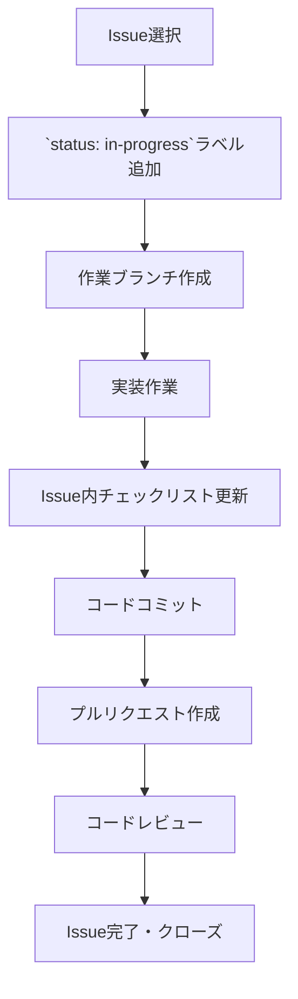

# Baketa プロジェクト開発ワークフロー

## 1. 基本原則

### 1.1 Issueの役割
- **単一責任**: 各Issueは1つの明確な課題または機能を対象とする
- **自己完結性**: 必要な情報はIssue内に記載する
- **トレーサビリティ**: 関連するコミット、PR、他のIssueとの関連付けを明確にする

### 1.2 Baketaプロジェクトのイシュー分類
- **機能実装**: ゲーム翻訳オーバーレイの新機能開発
- **バグ修正**: 既存機能の不具合対応
- **リファクタリング**: コード改善・最適化（機能変更なし）
- **ドキュメント**: 文書作成・更新
- **設計**: アーキテクチャ設計・検討

## 2. Issueのライフサイクル

### 2.1 標準的なフロー
1. **作成**: 詳細な情報と明確な完了条件を含めて作成
2. **計画**: 優先度付け、マイルストーン割り当て
3. **着手**: 担当者がアサインされ作業開始
4. **レビュー**: 必要に応じてコードレビュー
5. **完了**: 対応完了しIssueをクローズ

### 2.2 状態管理
- **Open**: 未対応または対応中
- **Closed**: 対応完了
- **詳細な状態**: ラベルで表現（例: status:in-progress）

## 3. ラベルの使用方法

### 3.1 標準ラベル体系
Baketaプロジェクトでは以下のラベル体系を使用します：

#### 種別（type）
- `type: feature` - 新機能の実装
- `type: bug` - バグ修正
- `type: refactor` - リファクタリング
- `type: documentation` - ドキュメント関連
- `type: design` - 設計関連

#### 優先度（priority）
- `priority: high` - 高優先度（できるだけ早く対応）
- `priority: medium` - 中優先度（標準的な対応速度）
- `priority: low` - 低優先度（余裕があれば対応）

#### コンポーネント（component）
- `component: core` - Core機能関連
- `component: ocr` - OCR機能関連
- `component: translation` - 翻訳機能関連
- `component: ui` - ユーザーインターフェース関連

#### 状態（status）
- `status: in-progress` - 対応中
- `status: review` - レビュー中
- `status: blocked` - ブロック中（依存関係などで進行不可）

### 3.2 ラベルの組み合わせ
各Issueには複数のラベルを付けることが可能です。基本セットとして以下を付与します：
- 種別ラベル（1つ）
- 優先度ラベル（1つ）
- コンポーネントラベル（1つ以上）
- 状態ラベル（必要に応じて）

例: `type: feature`, `priority: high`, `component: ocr`, `status: in-progress`

## 4. Issue作成のベストプラクティス

### 4.1 タイトルの付け方
明確で簡潔なタイトルをつけます。フォーマットは以下のパターンを推奨：

- 機能実装: `実装: [機能名]`
- バグ修正: `修正: [バグの簡潔な説明]`
- リファクタリング: `改善: [改善内容]`

例:
- `実装: OCR設定のJSON永続化機能`
- `修正: 差分検出アルゴリズムの誤検出問題`
- `改善: 翻訳キャッシュのパフォーマンス最適化`

### 4.2 本文の書き方
テンプレートに沿って、以下の要素を含めます：

1. **概要**: 1-2文で課題または機能の概要
2. **目的/理由**: なぜ必要なのかの説明
3. **詳細**: 実装詳細、再現手順、または要件
4. **タスク分解**: チェックボックス形式のサブタスク
5. **関連Issue/参考**: 関連するIssue番号やドキュメントへのリンク

### 4.3 効果的なタスク分解
各Issueは、進捗を追跡しやすいようにサブタスクに分解します：

```markdown
## タスク分解
- [ ] OcrSettings クラスにシリアライズメソッドを追加
- [ ] 設定ファイルの保存場所を決定
- [ ] 読み込み/保存処理の実装
- [ ] エラーハンドリングの追加
- [ ] 単体テストの作成
```

## 5. マイルストーンの活用

### 5.1 マイルストーン設計
Baketaプロジェクトでは、開発フェーズごとにマイルストーンを設定します：

1. **フェーズ1: 基盤システム** - コア機能とインフラ
2. **フェーズ2: OCR機能** - OCRエンジン関連機能
3. **フェーズ3: 翻訳機能** - 翻訳システム関連機能
4. **フェーズ4: UI実装** - ユーザーインターフェース

各マイルストーンには明確な期限と達成目標を設定します。

### 5.2 マイルストーンへのIssue割り当て
関連するIssueを適切なマイルストーンに割り当てます。これにより進捗の可視化と優先順位付けが容易になります。

## 6. プロジェクトボードとの連携

### 6.1 基本的なボード構成
Baketaプロジェクトでは以下の列を持つプロジェクトボードを使用します：

- **Backlog**: これから取り組むタスク
- **To Do**: 近日中に着手予定のタスク
- **In Progress**: 現在作業中のタスク
- **Review**: レビュー待ちのタスク
- **Done**: 完了したタスク

### 6.2 自動化ルール
効率化のために以下の自動化ルールを設定します：

- Issue作成時、自動的に「Backlog」に配置
- `status: in-progress`ラベルが付いたら「In Progress」列に移動
- `status: review`ラベルが付いたら「Review」列に移動
- Issueがクローズされたら「Done」列に移動

## 7. GitとIssueの連携

### 7.1 コミットメッセージとIssueの関連付け
コミットメッセージでIssue番号を参照することで、自動的にIssueにコミット履歴が記録されます：

```
実装: OCR設定管理機能 #42
```

### 7.2 キーワードによるIssueの自動操作
特定のキーワードを使用して、コミットやPRからIssueを操作できます：

- `fixes #42` - Issue #42を修正し、マージ時に自動クローズ
- `closes #42` - Issue #42を完了し、マージ時に自動クローズ
- `refs #42` - 参照のみ（クローズはしない）

例:
```
修正: 画面キャプチャの遅延問題 fixes #17
```

### 7.3 ブランチ命名規則
Issueに関連するブランチを作成する際の命名規則：

```
<種別>/<Issue番号>-<短い説明>
```

例:
- `feature/42-ocr-settings`
- `bugfix/17-capture-delay`
- `refactor/23-translation-cache`

## 8. Baketaプロジェクト特有の運用ルール

### 8.1 担当者割り当て
- 作業中のIssueには明示的に担当者を割り当てる
- 複数のタスクを同時に進行させる場合、優先順位を明確にする

### 8.2 作業時間の目安
- 1つのIssueは基本的に1-3日で完了できる粒度に分割する
- それ以上かかる場合は、複数のIssueに分割することを検討する

### 8.3 定期的な振り返り
- 週に1回、未解決Issueの見直しを行う
- 優先度の再評価、ブロックされている課題の特定、次週の作業計画を行う

### 8.4 コンポーネント間の依存関係
- コンポーネント間の依存関係があるIssueには、明示的に依存関係を記載する
  ```
  依存: #42を完了してから着手する必要があります
  ```

## 9. 便利なTipsとショートカット

### 9.1 Markdown記法
- チェックボックス: `- [ ] タスク`（完了したら `- [x] タスク`）
- コードブロック: ` ```csharp ～ ``` `
- テーブル: `| ヘッダー1 | ヘッダー2 | ... |`

### 9.2 メンションと参照
- ユーザーメンション: `@ユーザー名`
- Issue参照: `#42`
- コミット参照: `SHA`

### 9.3 検索と絞り込み
効率的な検索クエリ:
- `is:open label:"priority: high"` - 高優先の未解決Issue
- `label:"component: ocr" milestone:"フェーズ2"` - フェーズ2のOCR関連Issue
- `assignee:@me is:open` - 自分に割り当てられた未解決Issue

## 10. 開発ワークフロー

### 10.1 Issue着手時のワークフロー



1. **Issue選択**:
   - Backlogまたは優先度の高いIssueから作業対象を選ぶ
   - 自分をAssigneeに設定

2. **ラベル更新**:
   - `status: in-progress`ラベルを追加

3. **作業ブランチ作成**:
   ```bash
   git checkout -b feature/1-logging-system
   ```
   - ブランチ名は`<種別>/<Issue番号>-<短い説明>`の形式

4. **実装作業**:
   - コーディング標準規約に従って実装
   - 適宜、Issue内のチェックリストを更新（`- [x]`に変更）

5. **コミット規則**:
   - 小さな単位で頻繁にコミット
   - コミットメッセージにIssue番号を含める
   - メッセージ形式: `<種別>: <説明> #<Issue番号>`
   - 種別は以下から選択:
     - `add:` - 新機能・ファイル追加
     - `fix:` - バグ修正
     - `update:` - 機能改善・拡張
     - `refactor:` - リファクタリング
     - `doc:` - ドキュメント関連
     - `test:` - テスト関連
     - `chore:` - その他雑務

   例:
   ```
   add: ILogger インターフェース実装 #1
   update: ログレベルフィルタリング機能追加 #1
   fix: ログローテーション時のファイルロック問題 #1
   ```

6. **プルリクエスト作成**:
   - 機能が完成したらプルリクエストを作成
   - タイトルには`closes #<Issue番号>`を含める
   - 説明には変更内容の概要を記載
   - 自分で作成したPRは自分でマージしても良い（個人プロジェクトの場合）

7. **Issue完了**:
   - PRマージ後、Issueは自動的にクローズされる
   - 必要に応じて結果と次のステップをコメント

### 10.2 マージ後のクリーンアップ

```bash
git checkout main
git pull
git branch -d feature/1-logging-system  # 作業ブランチを削除
```

### 10.3 複数ブランチでの同時作業

複数のIssueに同時に取り組む場合:
- 各Issueに対して独立したブランチを作成
- 作業中のブランチ名は`git branch`で確認
- `git checkout <ブランチ名>`でブランチを切り替え

### 10.4 コンフリクト解決

マージ時にコンフリクトが発生した場合:
1. 最新のmainブランチを取得
   ```bash
   git checkout main
   git pull
   ```

2. 作業ブランチに最新のmainをマージ
   ```bash
   git checkout feature/1-logging-system
   git merge main
   ```

3. コンフリクト解決
   - コンフリクトファイルを編集
   - `git add <修正したファイル>`
   - `git commit -m "merge: mainブランチの変更を統合"`

### 10.5 作業規則

- 1日1回以上は作業ブランチを更新する
- コミット前に必ずビルド確認
- コミットメッセージは日本語で具体的に記述
- 1つのコミットは1つの論理的変更に限定
- テストやドキュメントの更新も忘れずに

## 11. サンプルIssue

### 機能実装のサンプル

```markdown
## 概要
OCRエンジンの設定を管理し、JSON形式で永続化する機能を実装します。

## 目的・理由
OCR設定をアプリケーション再起動後も維持するために、設定の永続化が必要です。
また、複数のゲームプロファイルごとに異なる設定を保存できるようにします。

## 詳細
- OcrSettings クラスをJSON形式でシリアライズ/デシリアライズ
- 設定ファイルは `%AppData%\Baketa\settings\ocr_settings.json` に保存
- ゲームプロファイル固有の設定は `%AppData%\Baketa\profiles\{gameId}_ocr.json` に保存
- 設定変更時は自動的に保存する機能を実装
- システム起動時に設定を読み込む機能を実装

## タスク分解
- [ ] OcrSettings クラスにJSONシリアライズ対応を追加
- [ ] 設定ファイルパスの決定と作成
- [ ] 設定読み込み機能の実装
- [ ] 設定保存機能の実装
- [ ] 変更検知と自動保存の実装
- [ ] エラーハンドリングの追加
- [ ] 単体テストの作成

## 関連Issue/参考
- 関連: #29 設定管理システムの基盤実装
- 参照: `Baketa.Core.Models.OcrSettings` クラス
```

### バグ修正のサンプル

```markdown
## バグの説明
差分検出アルゴリズムが、特定の条件下で誤検出を頻発し、不要なOCR処理が実行されています。
特に画面の明るさが急激に変化する場合（例: ゲーム内の日中/夜間の切り替わり）に顕著です。

## 再現手順
1. ファイナルファンタジーXIVを起動
2. 時間帯が変わる場所（例: 日没時のリムサ・ロミンサ）に移動
3. 差分検出のデバッグログを有効にする
4. 画面の明るさが変化する瞬間を観察
5. 多数の差分検出（特に空や水面部分）が記録される

## 期待される動作
テキスト部分に変化がない場合は、画面の明度変化のみでは差分を検出しないようにする。

## 環境情報
- OS: Windows 11
- アプリケーションバージョン: v0.9.0-dev
- ゲーム: ファイナルファンタジーXIV

## 追加情報
現在の差分検出アルゴリズムは `EnhancedDifferenceDetector.cs` の `HasSignificantChange` メソッドで実装されています。
単純なピクセル比較に加えて、適応的な閾値調整が必要かもしれません。
```