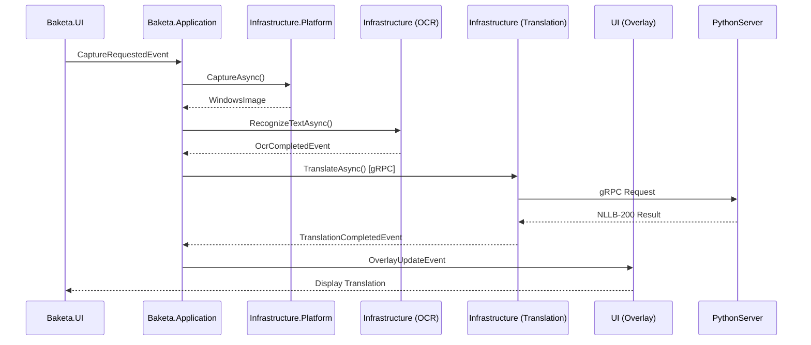

# Baketa Clean Architecture設計

## 概要

Baketaプロジェクトは**Clean Architecture**原則に基づく5層構造を採用しています。各層は明確な責務を持ち、依存方向は常に上位層から下位層への単方向です。

**最終更新**: 2025-11-17
**分析基準日**: 2025-10-04 (Phase 0.1-0.2)

---

## 1. アーキテクチャ構造

### 1.1 5層構造の概要

```
┌─────────────────────────────────────┐
│      Baketa.UI (Presentation)       │ ← 最上層
│  Avalonia UI + ReactiveUI MVVM      │
└──────────────┬──────────────────────┘
               │
               ↓
┌──────────────────────────────────────┐
│   Baketa.Application (Use Cases)     │
│  ビジネスロジック・オーケストレーション  │
└──────┬──────────┬────────────────────┘
       │          │
       ↓          ↓
┌─────────────┐  ┌────────────────────────────┐
│ Baketa.     │  │ Baketa.Infrastructure       │
│ Infrastructure│ │ OCR, Translation, Imaging   │
│ .Platform   │  │                             │
│ Windows実装 │  └────────────────────────────┘
└──────┬──────┘
       │          │
       └──────────┴────────────────────────────┐
                                               ↓
                  ┌────────────────────────────────┐
                  │      Baketa.Core (Domain)      │ ← 最下層
                  │  抽象化、インターフェース、DTO   │
                  └────────────────────────────────┘
```

### 1.2 依存関係グラフ

```
Baketa.Core (基底層 - 依存なし)
  ↑
  ├─ Baketa.Infrastructure
  │    ↑
  │    ├─ Baketa.Infrastructure.Platform
  │    │    ↑
  │    │    └─ Baketa.Application
  │    │         ↑
  │    └─────────┤
  │              │
  └──────────────┴─ Baketa.UI (最上層)
```

**検証結果**: ✅ 循環依存なし（Phase 0.1検証済み）

---

## 2. 各層の詳細

### 2.1 Baketa.Core (Domain Layer)

**依存**: なし
**役割**: プラットフォーム非依存の抽象化とコアロジック

#### 主要コンポーネント

- **Abstractions/** - インターフェース定義
  - `IEventAggregator` - イベント集約システム
  - `IImageProxy`, `IAdvancedImage` - 画像処理抽象化
  - `IOcrEngine`, `ITranslationEngine` - OCR/翻訳エンジン抽象化
  - `ICaptureService`, `IWindowManager` - キャプチャシステム抽象化
  - `ILicenseManager`, `ILicenseApiClient`, `ILicenseCacheService` - ライセンス管理抽象化
- **License/** - ライセンス管理コンポーネント（Issue #77）
  - `Models/PlanType.cs` - 4プランEnum（Free/Standard/Pro/Premia）
  - `Models/FeatureType.cs` - 機能ゲートEnum
  - `Models/LicenseState.cs` - ライセンス状態モデル
  - `Extensions/PlanTypeExtensions.cs` - プラン判定拡張メソッド
  - `Events/` - ライセンス関連イベント（StateChanged、TokenUsageWarning等）
- **Events/** - ドメインイベント定義
  - `OcrCompletedEvent`, `TranslationCompletedEvent`
  - `CaptureRequestedEvent`, `OverlayUpdateEvent`
- **Settings/** - 設定モデルとバリデーション
  - `TranslationSettings`, `OcrSettings`, `CaptureSettings`, `LicenseSettings`
- **DI/ServiceModuleBase.cs** - DIモジュールベースクラス

#### 主要パッケージ

```xml
<PackageReference Include="Microsoft.Extensions.DependencyInjection.Abstractions" Version="8.0.0" />
<PackageReference Include="Microsoft.Extensions.Logging.Abstractions" Version="8.0.0" />
<PackageReference Include="Microsoft.Extensions.Http" Version="8.0.0" />
<PackageReference Include="System.Threading.Tasks.Dataflow" Version="8.0.0" />
```

#### 設計原則

- ✅ プラットフォーム非依存
- ✅ 外部ライブラリ依存最小化
- ✅ インターフェース中心設計
- ✅ イミュータブルなDTO

---

### 2.2 Baketa.Infrastructure (Infrastructure Layer)

**依存**: Baketa.Core
**役割**: OCR、翻訳、画像処理などの実装

#### 主要コンポーネント

**OCR実装** (Baketa.Infrastructure/OCR/)
- **GrpcOcrClient.cs** - Surya OCR gRPCクライアント
  - 検出・認識: Surya OCR（gRPC経由、port 50052）
  - GPU/CUDA対応
  - 90+言語サポート
- **OcrServiceProxy.cs** - OCRサービスプロキシ

**翻訳実装** (Baketa.Infrastructure/Translation/)
- **GrpcTranslationClient.cs** - gRPC HTTP/2クライアント
  - NLLB-200 Python gRPCサーバー連携
  - Keep-Alive対応（10秒間隔）
  - 自動再接続機能
- **PythonServerManager.cs** - Pythonサーバー起動・管理
- **GeminiTranslationEngine.cs** - Google Gemini APIフォールバック

**画像処理** (Baketa.Infrastructure/Imaging/)
- **OpenCvWrapper.cs** - OpenCV 4.11.0ラッパー
- **Filters/** - 画像フィルターパイプライン
  - GrayscaleFilter, BinarizationFilter, NoiseReductionFilter
  - MorphologicalOperationsFilter, ContrastEnhancementFilter
- **ArrayPool統合** - Phase 5.2Cで86%メモリリーク削減

**ライセンス管理** (Baketa.Infrastructure/License/) - Issue #77
- **Services/LicenseManager.cs** - ILicenseManager実装
  - キャッシュ優先ライセンス状態管理
  - トークン消費追跡・警告イベント発行
  - オフライン対応（保留中消費の同期）
- **Services/LicenseCacheService.cs** - ローカルキャッシュ実装
- **Clients/MockLicenseApiClient.cs** - 開発・テスト用APIクライアント
- **Adapters/UserPlanServiceAdapter.cs** - 既存IUserPlanService後方互換アダプタ
- **DI/Modules/LicenseModule.cs** - DIコンテナ登録

#### 主要パッケージ

```xml
<PackageReference Include="OpenCvSharp4" Version="4.11.0.20250507" />
<PackageReference Include="Sdcb.PaddleOCR" Version="3.0.1" />
<PackageReference Include="Sdcb.PaddleInference" Version="3.0.1" />
<PackageReference Include="Microsoft.ML.OnnxRuntime" Version="1.17.1" />
<PackageReference Include="Grpc.Net.Client" Version="2.57.0" />
<PackageReference Include="Google.Cloud.Translation.V2" Version="3.0.0" />
```

#### Phase 0分析結果

**最適化済み**:
- ✅ Phase 5.2C: ArrayPool導入（86%メモリ削減）
- ✅ Phase 5.2D: gRPC Keep-Alive実装
- ✅ Issue #189: Surya OCR統合完了（PP-OCRv5から移行）
- ✅ Issue #77: ライセンス管理システム基盤（4プラン対応、テスト173件）

---

### 2.3 Baketa.Infrastructure.Platform (Platform Layer)

**依存**: Baketa.Core, Baketa.Infrastructure
**役割**: Windows固有の実装

#### 主要コンポーネント

**Windows Graphics Capture API** (Windows/Capture/)
- **BaketaCaptureNative.dll** - C++/WinRT実装
  - Windows Graphics Capture API (DirectX/OpenGL対応)
  - BGRA→RGB変換
  - メモリ効率的なテクスチャ処理
- **NativeWindowsCaptureWrapper.cs** - P/Invoke高レベルラッパー
- **NativeWindowsCapture.cs** - P/Invoke宣言

**PrintWindowフォールバック**
- GDI PrintWindow API（古いアプリ対応）

**モニター管理**
- `WindowsMonitorManager.cs` - DPI対応マルチモニター

#### 主要パッケージ

```xml
<PackageReference Include="Microsoft.Windows.CsWinRT" Version="2.2.0" />
<PackageReference Include="System.Management" Version="8.0.0" />
```

#### ビルド要件

- Visual Studio 2022
- Windows 10/11 SDK
- C++ Desktop Development Workload
- x64 Platform必須

---

### 2.4 Baketa.Application (Application Layer)

**依存**: Baketa.Core, Baketa.Infrastructure, Baketa.Infrastructure.Platform
**役割**: ビジネスロジック、サービス調整

#### 主要コンポーネント

**オーケストレーション** (Services/)
- **TranslationOrchestrationService.cs**
  - 自動翻訳ループ管理
  - 単発翻訳優先制御
  - gRPCサーバー自動起動
- **CaptureOrchestrationService.cs**
  - キャプチャ戦略統合
  - OCRパイプライン調整

**イベントハンドラー** (Events/)
- `OcrCompletedEventHandler` - OCR完了→翻訳開始
- `TranslationCompletedEventHandler` - 翻訳完了→オーバーレイ更新
- `CaptureRequestedEventHandler` - キャプチャリクエスト処理

**DIモジュール** (DI/Modules/)
- 優先度ベースモジュールロード
- 循環依存検出機能

#### 主要パッケージ

```xml
<PackageReference Include="Microsoft.Extensions.Hosting" Version="8.0.0" />
<PackageReference Include="System.Reactive" Version="6.0.0" />
```

#### Phase 5.3テスト結果

- **Baketa.Application.Tests**: 415テストケース
- **成功率**: 100% (Phase 5.3検証済み)

---

### 2.5 Baketa.UI (Presentation Layer)

**依存**: Baketa.Application, Baketa.Core, Baketa.Infrastructure.Platform
**役割**: Avalonia UIによるユーザーインターフェース

#### 主要コンポーネント

**MVVM実装** (ViewModels/)
- **ReactiveUI**ベース
- `ViewModelBase` - ベースクラス
- `MainWindowViewModel` - メインウィンドウ
- `SettingsViewModel` - 設定画面
- `TranslationOverlayViewModel` - オーバーレイ

**Views** (Views/)
- Avalonia XAMLビュー
- 透明オーバーレイウィンドウ
- ダークモード対応

**ナビゲーション**
- `INavigationService` - 画面遷移管理

#### 主要パッケージ

```xml
<PackageReference Include="Avalonia" Version="11.2.7" />
<PackageReference Include="Avalonia.ReactiveUI" Version="11.2.7" />
<PackageReference Include="ReactiveUI" Version="20.1.63" />
<PackageReference Include="Microsoft.Extensions.Hosting" Version="8.0.0" />
```

#### UI設計原則

- ✅ ReactiveUIによる宣言的UI
- ✅ IObservableによる状態管理
- ✅ ReactiveCommand<TParam, TResult>
- ✅ ValidationContext統合

---

## 3. 横断的関心事

### 3.1 イベント駆動アーキテクチャ

#### EventAggregator

```csharp
public interface IEventAggregator
{
    void Subscribe<TEvent>(IEventProcessor<TEvent> processor) where TEvent : IEvent;
    Task PublishAsync<TEvent>(TEvent eventData) where TEvent : IEvent;
}
```

**特徴**:
- 疎結合なモジュール間通信
- 優先度ベース処理（`SynchronousExecution`）
- Fire-and-Forget防止機能

#### 主要イベント

| イベント | 発行元 | 購読者 | 目的 |
|---------|--------|--------|------|
| `CaptureRequestedEvent` | UI | CaptureService | キャプチャ要求 |
| `OcrCompletedEvent` | OCREngine | TranslationService | OCR完了通知 |
| `TranslationCompletedEvent` | TranslationEngine | OverlayManager | 翻訳完了通知 |
| `OverlayUpdateEvent` | TranslationService | UI | オーバーレイ更新 |

### 3.2 依存性注入 (DI)

#### モジュール化DIシステム

```csharp
public abstract class ServiceModuleBase
{
    public abstract void Load(IServiceCollection services);
    public virtual int Priority => 100; // 優先度
}
```

**モジュール読み込み順序**:
1. Core層モジュール (Priority: 0)
2. Infrastructure層モジュール (Priority: 100)
3. Infrastructure.Platform層モジュール (Priority: 200)
4. Application層モジュール (Priority: 300)
5. UI層モジュール (Priority: 400)

**循環依存検出**: 起動時に自動チェック

### 3.3 設定管理

#### 階層的設定システム

```csharp
public class SettingsManager : ISettingsManager
{
    Task<T> LoadAsync<T>() where T : class, new();
    Task SaveAsync<T>(T settings) where T : class;
}
```

**設定ファイル**:
- `appsettings.json` - 基本設定
- `appsettings.Development.json` - 開発環境オーバーライド
- バージョン管理とマイグレーション機能

#### 主要設定クラス

| 設定クラス | 責務 | バリデーション |
|-----------|------|--------------|
| `TranslationSettings` | 翻訳エンジン設定 | LanguageCodeValidator |
| `OcrSettings` | OCRエンジン設定 | ModelPathValidator |
| `CaptureSettings` | キャプチャ設定 | IntervalValidator |
| `OverlaySettings` | オーバーレイ表示設定 | FontSizeValidator |

### 3.4 ロギング

#### ILogger統合

```csharp
private readonly ILogger<MyService> _logger;

_logger.LogInformation("Event {EventType} processing started", eventType.Name);
_logger.LogError(ex, "Translation failed: {Message}", ex.Message);
```

**ログレベル制御**: appsettings.json

**構造化ログ**: Application Insights対応

**⚠️ 禁止事項**: `DebugLogUtility.WriteLog()`の使用（デッドロックリスク）

---

## 4. データフロー

### 4.1 翻訳フロー全体像



### 4.2 4段階キャプチャ戦略

1. **Stage 1**: 画像変化検知（未実装、P0タスク）
2. **Stage 2**: 段階的フィルタリング（Phase 1で90.5%削減実現）
3. **Stage 3**: ProximityGrouping（実装済み）
4. **Stage 4**: OCR実行（Surya OCR gRPC）

### 4.3 gRPC翻訳システム

**アーキテクチャ**:
- **C# Client**: `GrpcTranslationClient` (HTTP/2)
- **Python Server**: NLLB-200 + CTranslate2 (80%メモリ削減)
- **Protocol**: gRPC (port 50051)
- **Keep-Alive**: 10秒間隔（112秒アイドルタイムアウト防止）

**自動起動シーケンス**:
1. 初回翻訳リクエスト
2. PythonServerManager.StartAsync()
3. Health Check (5秒タイムアウト)
4. Ready Check (Model loading確認)
5. WithWaitForReady(true) - TCP接続待機
6. RPC Call開始

---

## 5. Phase 0分析結果サマリー

### 5.1 静的解析結果

**実施日**: 2025-10-04
**ツール**: Roslynator 0.10.2

#### 主要発見事項

| 優先度 | 問題 | 件数 | 状態 |
|--------|------|------|------|
| P0 | CA1001 Dispose未実装 | 2件 | ✅ Phase 1.2修正済み |
| P0 | PaddleOcrEngine.cs (5,741行) | 1件 | 🔄 Phase 3-4分割中 |
| P1 | CS0162 到達不能コード | 20+件 | ✅ Phase 1.3削除済み |
| P1 | CS0067 未使用イベント | 2件 | ✅ Phase 1.3削除済み |

### 5.2 複雑度分析

**大規模ファイル Top 3**:
1. PaddleOcrEngine.cs: **5,741行** → 分割対象
2. BatchOcrProcessor.cs: 2,766行 → リファクタリング済み
3. ~~OptimizedPythonTranslationEngine.cs: 2,765行~~ → **Phase 3削除済み**

### 5.3 依存関係検証

✅ **循環依存なし**
✅ **Clean Architecture準拠**
✅ **依存方向: UI → Application → Infrastructure.Platform → Infrastructure → Core**

### 5.4 パフォーマンス改善実績

| Phase | 改善内容 | 効果 |
|-------|---------|------|
| Phase 5.2C | ArrayPool導入 | メモリリーク86%削減 |
| Phase 5.2D | gRPC Keep-Alive | 初回翻訳成功率100% |
| Phase 5.2E | モデルプリウォーミング | 起動時初期化最適化 |
| Issue #189 | Surya OCR統合 | OCR精度向上・日本語認識改善 |

---

## 6. テスト戦略

### 6.1 テストカバレッジ (Phase 5.3)

| プロジェクト | テスト数 | 主な対象 |
|------------|---------|----------|
| Baketa.Core.Tests | 511 | イベント集約、設定管理 |
| Baketa.Infrastructure.Tests | 492 | OCR、翻訳、画像処理 |
| Baketa.Application.Tests | 415 | ビジネスロジック |
| Baketa.UI.Tests | 74 | ReactiveUI ViewModels |
| Baketa.UI.IntegrationTests | 20 | UI統合テスト |
| Baketa.Integration.Tests | 6 | システム全体統合 |
| **合計** | **1,518** | **成功率: 100%** |

### 6.2 テスト原則

- ✅ インターフェースベースモッキング
- ✅ ArrayPoolリソース管理テスト
- ✅ 非同期処理のCancellationToken検証
- ✅ CI/CDでの自動実行（LocalOnlyタグ除外）

---

## 7. 今後の改善計画

### 7.1 P0タスク

- [ ] PaddleOcrEngine.cs分割 (5,741行 → 3ファイル)
  - 検出エンジン (Detection)
  - 認識エンジン (Recognition)
  - 前処理パイプライン (Preprocessing)

### 7.2 P1タスク

- [ ] Stage 1: 画像変化検知実装
- [ ] InPlaceTranslationOverlayManager分割 (1,067行)

### 7.3 技術的負債削減

- [ ] WIDTH_FIX問題調査完了
- [ ] 非推奨パッケージ削除（SharpDX系）

---

## 8. 関連ドキュメント

- `E:\dev\Baketa\docs\1-project\overview.md` - プロジェクト概要
- `E:\dev\Baketa\docs\2-development\coding-standards\testing-standards.md` - テスト標準
- `E:\dev\Baketa\docs\3-architecture\translation\grpc-system.md` - gRPCシステム設計
- `E:\dev\Baketa\docs\3-architecture\capture-system\windows-graphics-capture.md` - キャプチャシステム
- `E:\dev\Baketa\CLAUDE.md` - 開発ガイド総合

---

**This document was generated by integrating analysis results from `docs/refactoring/` (2025-10-04 Phase 0.1-0.2) with current implementation status (2025-11-17).**
