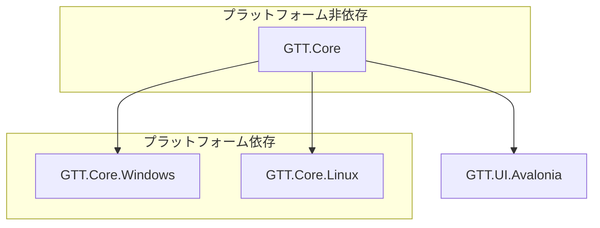

# プラットフォーム抽象化レイヤー設計ドキュメント

*最終更新: 2025年4月11日*

## 1. 概要

このドキュメントでは、GTTプロジェクトのプラットフォーム抽象化レイヤーの設計と実装について詳述します。プラットフォーム抽象化レイヤーは、Windows、Linux、macOSなど異なるオペレーティングシステム向けの実装を統一的なインターフェースで提供し、アプリケーションのクロスプラットフォーム対応を可能にします。

## 2. アーキテクチャ

プラットフォーム抽象化レイヤーは、以下のコンポーネントで構成されます：

```
GTT.Core/
├── Interfaces/
│   ├── Platform/
│   │   └── IPlatformService.cs      # プラットフォーム機能の抽象インターフェース
│   └── Capture/
│       └── IScreenCaptureService.cs # スクリーンキャプチャの抽象インターフェース
├── Services/
│   ├── Platform/
│   │   └── PlatformService.cs       # 基本プラットフォームサービス実装
│   └── Capture/
│       ├── BasicScreenCaptureService.cs    # 基本キャプチャサービス
│       └── ScreenCaptureServiceFactory.cs  # キャプチャサービスファクトリー
└── Extensions/
    └── ServiceCollectionExtensions.cs      # DIコンテナ拡張

GTT.Core.Windows/                    # Windows固有の実装
├── Platform/
│   └── WindowsPlatformService.cs    # Windows固有プラットフォームサービス
└── Capture/
    ├── WindowsScreenCaptureService.cs  # Windows固有キャプチャサービス
    └── Interop/
        └── WindowsNativeMethods.cs  # Windows APIへのP/Invoke

GTT.Core.Linux/                      # Linux固有の実装
├── Platform/
│   └── LinuxPlatformService.cs      # Linux固有プラットフォームサービス
└── Capture/
    └── LinuxScreenCaptureService.cs # Linux固有キャプチャサービス
```

### 2.1 依存関係図



## 3. インターフェースの定義

### 3.1 IPlatformService

`IPlatformService`は、プラットフォーム固有の機能を抽象化するインターフェースです。

```csharp
public interface IPlatformService
{
    bool IsWindows { get; }
    bool IsLinux { get; }
    bool IsMacOS { get; }
    string PlatformName { get; }
    
    Size GetPrimaryScreenSize();
    Rectangle GetWorkingArea();
    IReadOnlyList<DisplayInfo> GetDisplays();
    bool SupportsFeature(PlatformFeature feature);
    string GetSpecialFolderPath(SpecialFolder folder);
    string GetDefaultFontName();
}
```

**主要な責務**:
- 現在の実行プラットフォームを特定する
- スクリーン情報を取得する
- 特定のプラットフォーム機能がサポートされているかを確認する
- プラットフォーム固有のパスやフォント情報を提供する

### 3.2 IScreenCaptureService

`IScreenCaptureService`は、スクリーンキャプチャ機能を抽象化するインターフェースです。

```csharp
public interface IScreenCaptureService : IDisposable
{
    Task StartCaptureAsync(IntPtr windowHandle);
    Task StopCaptureAsync();
    Task UpdateCaptureSizeAsync(int width, int height);
    Task<IGTTImage?> GetLatestCaptureAsync();
    Task<IGTTImage?> CaptureScreenAsync();
    Task<IGTTImage?> CaptureAreaAsync(int x, int y, int width, int height);
    
    bool IsCapturing { get; }
    bool SupportsWindowCapture { get; }
    bool SupportsAreaSelection { get; }
}
```

**主要な責務**:
- 指定されたウィンドウのキャプチャを開始・停止する
- スクリーン全体または特定の領域のキャプチャを取得する
- キャプチャの状態とサポート機能を報告する

## 4. プラットフォーム固有の実装

### 4.1 Windows実装

Windows実装では、Win32 APIを使用して画面キャプチャやプラットフォーム情報取得を行います。

**主要なAPI**:
- `Windows API for Desktop Applications`
- `GDI+` (グラフィックスキャプチャ)
- `Windows Graphics Capture API` (Windows 10 1803以降)

**実装クラス**:
- `WindowsPlatformService`
- `WindowsScreenCaptureService`

### 4.2 将来の実装予定

以下のプラットフォーム対応は将来的な実装として計画されています。

#### Linux実装 (計画段階)

LinuxではX11/Waylandを使用して画面キャプチャやプラットフォーム情報取得を行う予定です。

**予定API**:
- X11 API (`libX11`, `libXrandr`)
- Wayland API

#### macOS実装 (計画段階)

macOS実装が将来的な実装として計画されています。

**予定API**:
- Core Graphics
- AppKit

## 5. フォールバックメカニズム

各プラットフォームでの実装失敗に備えて、堅牢なフォールバックメカニズムを実装しています：

1. **階層化フォールバック**:
   - 最初にプラットフォーム固有の最適実装を試行
   - 失敗した場合、代替実装を試行
   - すべての実装が失敗した場合、基本実装にフォールバック

2. **機能レベルのフォールバック**:
   - プラットフォーム固有の実装内でも、高度な機能から基本機能へのフォールバックを実装
   - 例: Windows Graphics Capture API → 通常のGDI+ → Bitmap

3. **動的ロード**:
   - プラットフォーム実装は動的に読み込まれ、コアモジュールに強依存しない設計
   - リフレクションを使用して適切な実装を発見し読み込む

## 6. プラットフォーム検出と依存性注入

```csharp
// プラットフォーム検出
bool isWindows = OperatingSystem.IsWindows();
bool isLinux = OperatingSystem.IsLinux();
bool isMacOS = OperatingSystem.IsMacOS();

// 依存性注入
services.AddSingleton<IPlatformService>(sp => 
{
    if (isWindows)
        return new WindowsPlatformService(/*...*/);
    else if (isLinux)
        return new LinuxPlatformService(/*...*/);
    else
        return new PlatformService(/*...*/);
});
```

## 7. 実装上の注意点

### 7.1 Windows固有コード

- `[SupportedOSPlatform("windows")]`属性で明示的にマーク
- P/Invoke呼び出しは`WindowsNativeMethods`クラスにカプセル化
- `LibraryImport`属性を使用して最新のP/Invoke方式を採用

### 7.2 Linux固有コード

- `[SupportedOSPlatform("linux")]`属性で明示的にマーク
- X11/Wayland APIへのアクセスは専用クラスにカプセル化
- ディストリビューション間の差異に対応するためのフォールバック機構

### 7.3 共通の設計原則

- エラー耐性: すべての外部API呼び出しは適切な例外処理でラップ
- ログ記録: 詳細なログを使用してトラブルシューティングを容易に
- 非同期処理: UI応答性確保のための非同期処理の徹底

## 8. プラットフォームサポート現況

| 機能 | Windows | Linux | macOS |
|------|---------|-------|-------|
| プラットフォーム情報取得 | ✅ 完全対応 | ⚠️ 将来対応 | ⚠️ 将来対応 |
| スクリーンキャプチャ | ✅ 完全対応 | ⚠️ 将来対応 | ⚠️ 将来対応 |
| ウィンドウキャプチャ | ✅ 完全対応 | ⚠️ 将来対応 | ⚠️ 将来対応 |
| 領域キャプチャ | ✅ 完全対応 | ⚠️ 将来対応 | ⚠️ 将来対応 |

## 9. 今後の拡張計画

1. **クロスプラットフォーム実装の拡充**:
   - Linux向け実装: X11/Waylandを使用したキャプチャ機能
   - macOS向け実装: Core Graphics/AppKitを使用した実装

2. **追加プラットフォーム機能**:
   - システムテーマ（ダーク/ライト）の検出と適用
   - プラットフォームの通知API統合
   - プラットフォーム固有の入力デバイス対応
