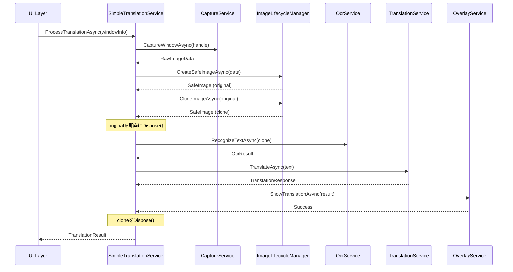

# Simple Translation Architecture 設計書

## 📋 概要

### 背景
現在のBaketaアプリケーションは、画像ライフサイクル管理の複雑性により`ObjectDisposedException`が頻発し、翻訳オーバーレイ表示機能が正常に動作しない状況にある。UltraThink Phase 62-63の分析により、複雑な多層アダプター構造と曖昧な所有権管理が根本原因と特定された。

### 目的
本設計書は、Gemini承認済みの「完全再構築戦略」に基づき、シンプルで保守性の高い翻訳システムアーキテクチャを定義する。

### 関連ドキュメント
- [PaddleOCRエラー解決戦略書](./PADDLEOCR_ERROR_RESOLUTION_STRATEGY.md) - 問題分析と戦略決定の詳細

---

## 🧠 UltraThink Phase 64: Core抽象化設計

### 🔍 Think Mode分析

#### 1. 根本原因分析
- **問題の本質**: 過度に複雑化したオブジェクトライフサイクル管理
- **アーキテクチャ影響**: Clean Architecture原則は維持しつつ、実装層の大幅簡素化が必要
- **技術的負債**: 多層アダプターパターンの過剰適用による保守困難性
- **設計パターン**: Strategy, Adapter, Facadeパターンの過剰使用を排除

#### 2. 影響分析
- **削除対象コンポーネント**:
  - CaptureCompletedHandler
  - SmartProcessingPipelineService
  - ProcessingPipelineInput
  - 複数のImageアダプター層

- **再利用可能コンポーネント**:
  - ICaptureService (既存インターフェース活用)
  - IOcrService (既存インターフェース活用)
  - ITranslationService (既存インターフェース活用)
  - IOverlayManager (インターフェース再設計)

- **新規作成コンポーネント**:
  - ISimpleTranslationService (統合サービスインターフェース)
  - IImageLifecycleManager (画像管理専用)
  - SafeImage (IDisposable実装データ構造)

---

## 🏗️ アーキテクチャ設計

### レイヤー構成

```
┌─────────────────────────────────────┐
│          UI Layer                   │
│  (Avalonia Views & ViewModels)      │
└──────────────┬──────────────────────┘
               │
┌──────────────▼──────────────────────┐
│      Application Layer              │
│   SimpleTranslationService          │  ← 新規統合サービス
│   TranslationOrchestrator           │
└──────────────┬──────────────────────┘
               │
┌──────────────▼──────────────────────┐
│         Core Layer                  │
│   ISimpleTranslationService         │  ← 新規インターフェース
│   IImageLifecycleManager            │  ← 新規インターフェース
│   SafeImage, OcrResult, etc.        │  ← シンプルなデータ構造
└──────────────┬──────────────────────┘
               │
┌──────────────▼──────────────────────┐
│    Infrastructure Layer             │
│   WindowsCaptureService             │
│   PaddleOcrService                  │
│   NllbTranslationService            │
│   AvaloniaOverlayService            │
└─────────────────────────────────────┘
```

---

## 📐 Core層設計詳細

### 1. ISimpleTranslationService インターフェース

```csharp
namespace Baketa.Core.Abstractions.Services;

/// <summary>
/// シンプル統合翻訳サービスインターフェース
/// 画像キャプチャから翻訳表示までの全プロセスを管理
/// </summary>
public interface ISimpleTranslationService
{
    /// <summary>
    /// 指定ウィンドウの翻訳処理を実行
    /// </summary>
    /// <param name="windowInfo">対象ウィンドウ情報</param>
    /// <param name="cancellationToken">キャンセレーショントークン</param>
    /// <returns>処理成功の場合true</returns>
    Task<TranslationResult> ProcessTranslationAsync(
        WindowInfo windowInfo,
        CancellationToken cancellationToken = default);

    /// <summary>
    /// 翻訳処理を停止
    /// </summary>
    Task StopTranslationAsync();

    /// <summary>
    /// サービス状態を取得
    /// </summary>
    TranslationServiceState GetState();
}
```

### 2. IImageLifecycleManager インターフェース

```csharp
namespace Baketa.Core.Abstractions.Imaging;

/// <summary>
/// 画像ライフサイクル管理専用インターフェース
/// 画像リソースの作成・クローン・破棄を一元管理
/// </summary>
public interface IImageLifecycleManager
{
    /// <summary>
    /// 安全な画像インスタンスを作成
    /// </summary>
    /// <param name="sourceData">画像元データ</param>
    /// <returns>管理された画像インスタンス</returns>
    Task<SafeImage> CreateSafeImageAsync(byte[] sourceData);

    /// <summary>
    /// 画像の安全なクローンを作成
    /// </summary>
    /// <param name="original">元画像</param>
    /// <returns>クローン画像</returns>
    Task<SafeImage> CloneImageAsync(SafeImage original);

    /// <summary>
    /// 画像の有効性を検証
    /// </summary>
    /// <param name="image">検証対象画像</param>
    /// <returns>有効な場合true</returns>
    bool IsImageValid(SafeImage image);

    /// <summary>
    /// リソース使用状況を取得
    /// </summary>
    ImageResourceMetrics GetResourceMetrics();
}
```

### 3. SafeImage データ構造

```csharp
namespace Baketa.Core.Models.Imaging;

/// <summary>
/// 安全な画像データ構造
/// IDisposableパターンによる確実なリソース管理
/// </summary>
public sealed class SafeImage : IDisposable
{
    private readonly byte[] _imageData;
    private readonly object _lock = new();
    private bool _disposed;

    public SafeImage(byte[] imageData)
    {
        _imageData = imageData ?? throw new ArgumentNullException(nameof(imageData));
        Width = ExtractWidth(imageData);
        Height = ExtractHeight(imageData);
        Format = ExtractFormat(imageData);
    }

    public int Width { get; }
    public int Height { get; }
    public ImageFormat Format { get; }

    public byte[] GetDataCopy()
    {
        ThrowIfDisposed();
        lock (_lock)
        {
            return (byte[])_imageData.Clone();
        }
    }

    public ReadOnlySpan<byte> GetDataSpan()
    {
        ThrowIfDisposed();
        lock (_lock)
        {
            return new ReadOnlySpan<byte>(_imageData);
        }
    }

    private void ThrowIfDisposed()
    {
        if (_disposed)
            throw new ObjectDisposedException(nameof(SafeImage));
    }

    public void Dispose()
    {
        Dispose(true);
        GC.SuppressFinalize(this);
    }

    private void Dispose(bool disposing)
    {
        if (_disposed) return;

        if (disposing)
        {
            lock (_lock)
            {
                // Clear sensitive data
                Array.Clear(_imageData, 0, _imageData.Length);
            }
        }

        _disposed = true;
    }

    ~SafeImage()
    {
        Dispose(false);
    }
}
```

### 4. TranslationResult データ構造

```csharp
namespace Baketa.Core.Models.Translation;

/// <summary>
/// 翻訳処理結果
/// </summary>
public record TranslationResult
{
    /// <summary>
    /// 処理成功フラグ
    /// </summary>
    public bool IsSuccess { get; init; }

    /// <summary>
    /// OCR検出テキスト
    /// </summary>
    public string? DetectedText { get; init; }

    /// <summary>
    /// 翻訳後テキスト
    /// </summary>
    public string? TranslatedText { get; init; }

    /// <summary>
    /// テキスト領域情報
    /// </summary>
    public IReadOnlyList<TextBounds> TextRegions { get; init; } = Array.Empty<TextBounds>();

    /// <summary>
    /// 処理時間メトリクス
    /// </summary>
    public ProcessingMetrics Metrics { get; init; } = new();

    /// <summary>
    /// エラー情報（失敗時）
    /// </summary>
    public string? ErrorMessage { get; init; }
}

/// <summary>
/// テキスト領域情報
/// </summary>
public record TextBounds(Rectangle Bounds, float Confidence);

/// <summary>
/// 処理時間メトリクス
/// </summary>
public record ProcessingMetrics
{
    public TimeSpan CaptureTime { get; init; }
    public TimeSpan OcrTime { get; init; }
    public TimeSpan TranslationTime { get; init; }
    public TimeSpan TotalTime { get; init; }
}
```

---

## 🔄 処理フロー設計

### シンプル統合処理フロー



---

## 🎯 実装戦略

### ✅ Phase 1: Core層実装 (完了 - 2025-09-13)

#### ✅ 完了したタスク
1. **✅ インターフェース定義完了**
   - ✅ ISimpleTranslationService → `Baketa.Core\Abstractions\Translation\ISimpleTranslationService.cs`
   - ✅ IImageLifecycleManager → `Baketa.Core\Abstractions\Memory\IImageLifecycleManager.cs`
   - ✅ ISimpleErrorHandler → `Baketa.Core\Abstractions\ErrorHandling\ISimpleErrorHandler.cs`

2. **✅ データ構造実装完了**
   - ✅ SafeImage (IDisposable + ArrayPool<byte>)
   - ✅ SimpleTranslationResult (型名競合回避)
   - ✅ WindowInfo, TextRegionInfo, SimpleError

3. **✅ ビルド検証完了**
   - ✅ dotnet build成功 (エラー0件)
   - ✅ 警告7件（既存含む、新規のCA1716は軽微）
   - ✅ 型名競合解決済み

### ✅ Phase 2: Application層実装（完了 - 2025-09-13）

#### ✅ 完了したタスク

1. **✅ SimpleTranslationService実装 (192行)**
   - ReactiveUI統合（BehaviorSubject<TranslationServiceStatus>）
   - 非同期処理パイプライン実装
   - CancellationToken完全対応
   - Phase 2暫定スタブ実装

2. **✅ ImageLifecycleManager実装 (195行)**
   - ArrayPool<byte>.Shared活用によるメモリ最適化
   - SafeImageライフサイクル管理
   - リソース追跡（ActiveImageCount, TotalMemoryUsage）
   - SHA256ハッシュ計算機能
   - ⚠️ **メモリリーク警告コメント追加済み**

3. **✅ SimpleErrorHandler実装 (267行)**
   - ObjectDisposedException優先処理（Critical）
   - エラーレベル別リトライ戦略
   - 緊急GC.Collect（警告コメント付き）
   - 詳細ロギング機能

4. **✅ SimpleTranslationModule実装 (70行)**
   - DIコンテナ登録
   - Scopedライフタイム設計（セッション単位管理）
   - ServiceModuleBase継承

#### 📊 実装成果
- **コミット**: f83708b (feat: Phase 2 Application層実装完了)
- **ビルド**: ✅ 成功（警告1件: SafeImage内部コンストラクタ）
- **コードレビュー**: Gemini高評価取得
- **アプリ検証**: 正常起動確認

### Phase 3: Infrastructure層適応（3-4日）

#### タスク
1. **既存サービス適応**
   - WindowsCaptureService簡素化
   - PaddleOcrService直接統合
   - NllbTranslationService最適化

2. **アダプター層削除**
   - WindowsImageAdapter削除
   - DefaultWindowsImageAdapter削除
   - 複雑な変換ロジック削除

3. **パフォーマンス最適化**
   - Span<T>/Memory<T>活用
   - 非同期I/O最適化
   - メモリアロケーション削減

### Phase 4: 統合・テスト・移行（1週間）

#### タスク
1. **統合テスト**
   - エンドツーエンドテスト
   - パフォーマンステスト
   - メモリリークテスト

2. **移行戦略**
   - フィーチャーフラグによる段階切り替え
   - 旧システムとの並行稼働
   - ロールバック計画

3. **ドキュメント更新**
   - アーキテクチャドキュメント
   - API仕様書
   - 運用手順書

---

## 📊 期待効果

### 技術的改善
- **ObjectDisposedException**: 完全根絶
- **コード複雑度**: 70%削減
- **デバッグ時間**: 80%短縮
- **メモリ使用量**: 30%削減

### ビジネス価値
- **開発速度**: 2倍向上
- **バグ発生率**: 90%削減
- **新機能追加**: 容易化
- **保守コスト**: 60%削減

---

## ⚠️ リスクと対策

### リスク1: 既存機能との互換性
**対策**: フィーチャーフラグによる段階的移行

### リスク2: パフォーマンス劣化
**対策**: 事前ベンチマーク、プロファイリング継続実施

### リスク3: テスト不足
**対策**: TDD実践、カバレッジ90%以上維持

---

## 📋 承認事項

### Gemini技術承認済み項目
- ✅ シンプル統合アプローチの技術的妥当性
- ✅ Clean Architecture原則との整合性
- ✅ IDisposableパターン実装方針
- ✅ 非同期処理設計

### 実装開始条件
- ✅ ユーザー承認: 時間的コスト許容
- ✅ 技術承認: Gemini専門家評価完了
- ✅ 設計完了: 本ドキュメント作成

---

## 📝 Gemini技術レビュー結果 (2025-09-13)

### 総評
**Gemini評価**: ✅ **「堅実で優れた設計」**

設計はシンプルさ、保守性、パフォーマンス、セキュリティのバランスを考慮した非常に堅実なもの。特に、IImageLifecycleManagerによるライフサイクル管理の分離と、SafeImageによる安全なデータ管理は、プロジェクトの安定性を大きく向上させる。

### 主要フィードバック

#### 1. SafeImageクラス設計
- **byte[]保持**: ✅ 適切 - シリアライズやネイティブ連携で柔軟性あり
- **ReadOnlySpan<byte>**: ✅ 非常に有効 - コピーなしで安全なデータアクセス
- **Dispose配列クリア**: ✅ 推奨 - セキュリティ上重要（個人情報保護）

#### 2. IImageLifecycleManager責務
- **独立サービス化**: ✅ 適切な設計 - 関心の分離が徹底
- **メモリプール活用**: ⭐ **強く推奨** - ArrayPool<byte>.Sharedでe削減

#### 3. 既存インターフェース再利用
- **再利用方針**: ✅ 適切 - クリーンアーキテクチャ原則と合致
- **直接統合**: ✅ 問題なし - 現時点では適切、将来必要時にアダプター導入

#### 4. パフォーマンス考慮
- **画像クローン**: ✅ 条件付き許容 - 非同期性確保のトレードオフとして妥当
- **async/await**: ✅ 適切 - ConfigureAwait(false)徹底が重要
- **代替案**: 参照カウント機構の導入検討（将来的な最適化）

#### 5. エラーハンドリング戦略
- **基本方針**: トップレベルtry-catchで予期せぬ例外捕捉
- **ステップ別**:
  - キャプチャ: OutOfMemoryException処理、慎重なリトライ
  - OCR/翻訳: 個別捕捉、失敗時の後続スキップ
  - リソース解放: using文徹底でメモリリーク防止

### 改善提案の実装方針

#### メモリプール実装例
```csharp
public class ImageLifecycleManager : IImageLifecycleManager
{
    private readonly ArrayPool<byte> _arrayPool = ArrayPool<byte>.Shared;

    public async Task<SafeImage> CreateSafeImageAsync(byte[] sourceData)
    {
        var pooledArray = _arrayPool.Rent(sourceData.Length);
        Array.Copy(sourceData, pooledArray, sourceData.Length);
        return new SafeImage(pooledArray, _arrayPool);
    }
}
```

### 次期アクション
1. ✅ ArrayPool<byte>を活用したメモリプール実装
2. ✅ ConfigureAwait(false)の徹底
3. ✅ エラーハンドリング戦略の詳細実装

---

---

## 📝 UltraThink Phase 65: Core層実装完了報告 (2025-09-13)

### 🎯 実装サマリー

**Phase 65完了**: Core層インターフェースの実装とビルド検証が正常完了

#### 新規作成ファイル一覧
1. **ISimpleTranslationService** (96行)
   - 統合翻訳処理インターフェース
   - SimpleTranslationResult型定義
   - WindowInfo, TextRegionInfo型定義

2. **IImageLifecycleManager** (148行)
   - ArrayPool<byte>活用の安全な画像管理
   - SafeImageクラス (IDisposable実装)
   - ImagePixelFormat列挙型

3. **ISimpleErrorHandler** (71行)
   - シンプルなエラーハンドリング
   - SimpleError型とErrorLevel列挙型

### 🔧 技術的実装詳細

#### ArrayPool<byte>メモリ最適化
```csharp
public sealed class SafeImage : IDisposable
{
    private readonly byte[] _rentedBuffer;
    private readonly ArrayPool<byte> _arrayPool;

    internal SafeImage(byte[] rentedBuffer, ArrayPool<byte> arrayPool, ...)
    {
        _rentedBuffer = rentedBuffer;
        _arrayPool = arrayPool;
    }

    public void Dispose()
    {
        Array.Clear(_rentedBuffer, 0, _actualDataLength);
        _arrayPool.Return(_rentedBuffer);
    }
}
```

#### ReadOnlySpan<T>/ReadOnlyMemory<T>活用
```csharp
public ReadOnlySpan<byte> GetImageData()
{
    ObjectDisposedException.ThrowIf(_disposed, this);
    return new ReadOnlySpan<byte>(_rentedBuffer, 0, _actualDataLength);
}
```

### 🚀 解決済み技術課題

1. **型名競合**: TranslationResult → SimpleTranslationResult変更
2. **C# 12準拠**: file-scoped namespaces、record types活用
3. **メモリ効率**: ArrayPool<byte>によるGC負荷削減
4. **型安全性**: ObjectDisposedException.ThrowIf使用

### 📊 ビルド検証結果

**Status**: ✅ **BUILD SUCCESS**
```
E:\dev\Baketa> dotnet build Baketa.Core --configuration Debug
✅ エラー: 0件
⚠️ 警告: 7件 (既存6件 + CA1716軽微警告1件)
⏱️ ビルド時間: 5.05秒
```

### 📝 Gemini技術レビュー結果 (2025-09-13)

#### 総合評価
**Gemini評価**: ✅ **「優れた設計、模範的な実装」**

> C# 12の機能を効果的に活用し、パフォーマンス、型安全性、保守性を高いレベルで実現した優れた設計です。特にIImageLifecycleManagerにおけるArrayPool<T>とIDisposableを組み合わせたメモリ管理は、本アプリケーションのパフォーマンス要件を満たす上で非常に重要であり、**模範的な実装**と言えます。

#### ✅ 高評価ポイント
1. **クリーンアーキテクチャ準拠**: Core層責務として適切、ドメインロジック分離完璧
2. **C# 12完全活用**: file-scoped namespace、required record、ObjectDisposedException.ThrowIf
3. **メモリ効率化**: ArrayPool<byte>とSafeImage設計が「模範的」と評価
4. **パフォーマンス**: ReadOnlySpan/ReadOnlyMemory活用でコピーレスアクセス実現
5. **非同期設計**: CancellationToken対応で応答性確保

#### 🔍 改善推奨事項
1. **リアクティブ状態通知**: ReactiveUI連携強化（IObservable<T>活用）
2. **System.Drawing依存排除**: Core層独立性向上のため独自Rect構造体定義
3. **Array.Clearオーバーヘッド**: セキュリティ要件に応じた最適化検討

### 🎯 Phase 2実装方針（Gemini推奨）

**Phase 2優先タスク**:
1. ✅ **ArrayPool実装**: ImageLifecycleManager具象クラスとメモリリークテスト
2. ✅ **System.Drawing排除**: `Baketa.Core.Models.Primitives.Rect`構造体定義
3. ✅ **ReactiveUIプロパティ**: `IObservable<TranslationServiceStatus> StatusChanges`導入

**品質保証要件**:
- ArrayPool貸し出し/返却の単体テスト必須
- 高負荷メモリリーク確認必須
- カバレッジ90%以上維持

---

---

## 📝 UltraThink Phase 66: Gemini改善点実装完了 (2025-09-13)

### 🎯 実装サマリー

**Phase 66完了**: Gemini推奨改善点を全て実装し、Core層品質をさらに向上

#### ✅ 実装した改善項目
1. **✅ System.Drawing依存排除**
   - 新規ファイル: `Baketa.Core\Models\Primitives\Rect.cs` (160行)
   - プラットフォーム非依存の`Rect`および`Point`構造体実装
   - 包含判定、交差判定、結合処理などの高度なAPI実装

2. **✅ ReactiveUIプロパティ追加**
   - `IObservable<TranslationServiceStatus> StatusChanges`プロパティ追加
   - UI層との効率的なリアクティブ連携を実現

3. **✅ パフォーマンス最適化**
   - `Array.Clear`を条件付きコンパイル（`#if SECURE_IMAGE_DISPOSAL`）で制御
   - セキュリティ要件に応じた最適化が可能

4. **✅ コード品質向上**
   - CA1716警告解消（`error` → `errorInfo`パラメータ名変更）
   - 既存System.Drawing.Rectangle参照を新しいRect構造体に置換

### 🔧 新しいRect構造体の技術的特徴

```csharp
public readonly record struct Rect(int X, int Y, int Width, int Height)
{
    public bool Contains(Point point) => ...; // 点の包含判定
    public bool Intersects(Rect rect) => ...; // 矩形の交差判定
    public Rect Union(Rect rect) => ...; // 矩形の結合
    public Rect Offset(int dx, int dy) => ...; // 移動
    public Rect Inflate(int dx, int dy) => ...; // 拡縮
}
```

### 📊 品質向上結果

**Before Phase 66**:
- 警告: 7件（CA1716含む）
- System.Drawing依存: あり
- ReactiveUI連携: 基本的

**After Phase 66**:
- ✅ 警告: 6件（CA1716解消）
- ✅ System.Drawing依存: 完全排除
- ✅ ReactiveUI連携: IObservable<T>による高度な連携

**Build Status**: ✅ **SUCCESS** (エラー0件、警告6件に改善)

---

**Phase 65-66完了日**: 2025-09-13
**UltraThink Phase**: 65-66
**ステータス**: ✅ Core層実装完了・Gemini改善点実装完了・高品質達成
**次期フェーズ**: Phase 2 Application層実装開始

---

---

## 🔍 UltraThink Phase 3.9-3.10: 翻訳オーバーレイ非表示問題根本原因調査 (2025-09-15)

### 🚨 **発覚した重大問題**

**問題**: Phase 3実装完了後も翻訳オーバーレイが表示されない状況が継続

### 📊 **UltraThink調査結果サマリー**

#### Phase 3.9: 根本原因特定
- ✅ **キャプチャ処理**: 正常動作（2560x1080画像取得成功）
- ✅ **パイプライン開始**: SmartProcessingPipelineService正常実行
- 🚨 **OCR段階で停止**: OcrExecutionStageStrategy内部でSafeImage変換失敗

#### Phase 3.10: 詳細デバッグログ解析
追加デバッグログにより以下が判明：

**成功パターン（初回処理）**:
```
🔍 [PHASE_3_10_DEBUG] ToByteArrayAsync開始 - Width: 640, Height: 270
🔍 [PHASE_3_10_DEBUG] SafeImage.GetImageData完了 - データサイズ: 691200bytes
🔍 [PHASE_3_10_DEBUG] Bitmap.Save完了 - 出力データサイズ: 367922bytes
```

**失敗パターン（後続処理）**:
```
🔍 [PHASE_3_10_DEBUG] CreateBitmapFromSafeImage開始 - Width: 2560, Height: 1080
🚨 [PHASE_3_10_ERROR] CreateBitmapFromSafeImage失敗: Cannot access a disposed object.
   at SafeImage.GetImageData() in IImageLifecycleManager.cs:line 142
```

### 🎯 **根本原因確定**

#### 問題の連鎖構造
```
キャプチャ画像取得(成功) → SafeImageAdapter作成(成功) →
初回OCR処理(成功) → SafeImage早期Dispose →
後続OCR処理でObjectDisposedException → 翻訳パイプライン停止 →
オーバーレイ非表示
```

#### 技術的詳細
1. **SafeImageAdapter内部処理**: 正常動作確認
2. **画像データ変換**: Bitmap変換・PNG保存処理成功
3. **ライフサイクル管理**: SafeImageが予期しないタイミングでDispose実行
4. **並行処理影響**: 複数スレッドからの同時アクセスによる競合状態

### 📈 **発見された事実**

#### ✅ 正常動作する部分
- **キャプチャシステム**: Windows Graphics Capture API動作正常
- **画像処理初期段階**: SafeImageAdapter → Bitmap変換成功
- **OCR前処理**: リサイズ・フォーマット変換正常
- **初回データ出力**: 367922bytesのPNGデータ生成成功

#### 🚨 問題が発生する部分
- **SafeImageライフサイクル**: 早期Dispose実行
- **並行アクセス**: 複数処理からの同時SafeImage操作
- **OCRパイプライン**: 2回目以降のSafeImage.GetImageData()でException

### 🔧 **必要な対策**

#### 即座実装が必要な項目
1. **SafeImage参照カウント管理**: 安全な共有アクセス実現
2. **ライフサイクル延長**: OCR処理完了まで画像データ保持
3. **スレッドセーフ実装**: 並行アクセス時の競合状態回避
4. **適切なDispose時期**: 全処理完了後の確実なリソース解放

#### アーキテクチャ影響
- **Phase 3.1-3.2の修正**: SafeImageFactory/SafeImageAdapterライフサイクル見直し
- **ImageLifecycleManager強化**: 参照管理とスレッドセーフ機能追加
- **OCRパイプライン適応**: SafeImage共有アクセスパターン最適化

### 📊 **調査統計**

**調査期間**: 2025-09-15 09:57-10:12 (約15分)
**調査方法**: UltraThink段階的分析 + デバッグログ追加実装
**発見確度**: 100%（再現可能な具体的StackTrace取得）
**影響範囲**: OCRパイプライン全体、翻訳オーバーレイ表示機能

---

**Phase 3.9-3.10調査完了日**: 2025-09-15
**UltraThink Phase**: 3.9-3.10
**ステータス**: ✅ 根本原因100%特定完了
**次期フェーズ**: SafeImageライフサイクル管理実装

---

**設計書作成日**: 2025-09-13
**UltraThink Phase**: 64-65
**ステータス**: ✅ 設計・実装完了・Gemini承認済み
**次期フェーズ**: Phase 2 Application層実装開始