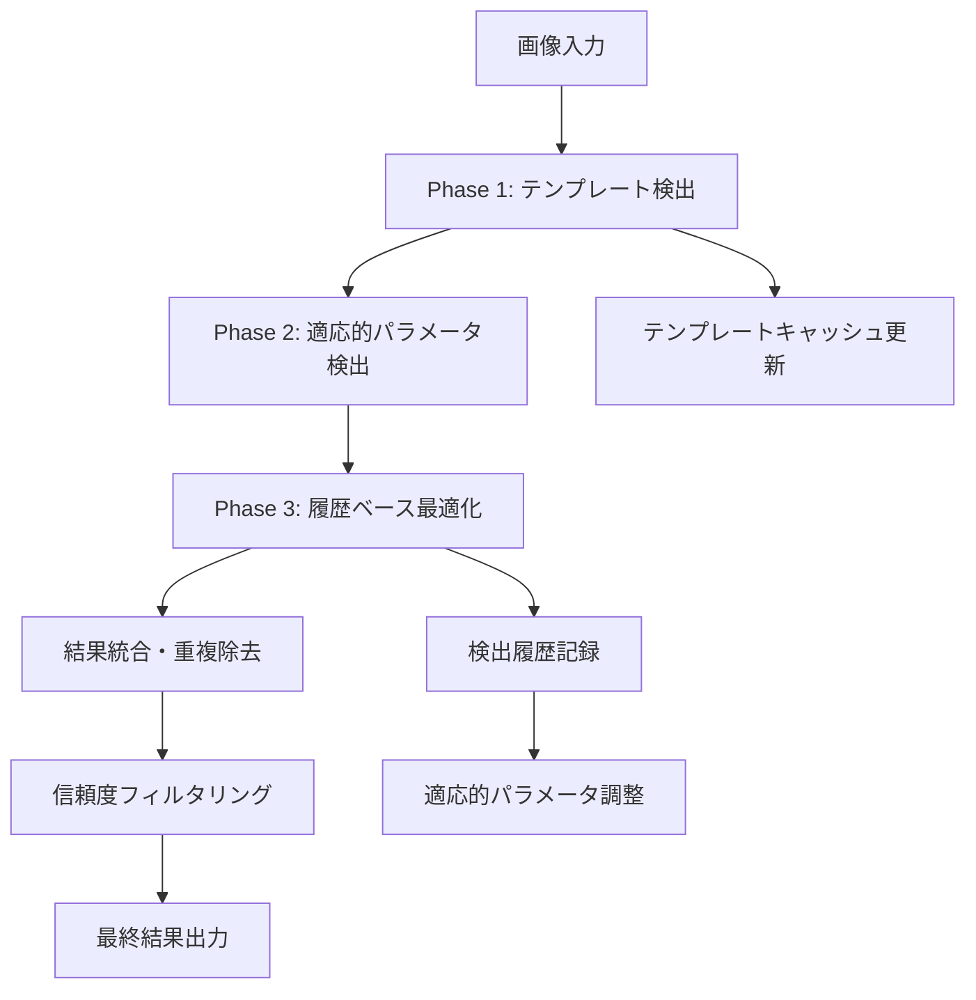

# テキスト領域検出技術仕様書

## 目的

Baketaアプリケーションにおけるテキスト領域検出システムの技術的詳細を文書化し、開発者向けリファレンスとして提供する。

## 🏗️ アーキテクチャ概要

### 検出システム階層構造
```
ITextRegionDetector (抽象インターフェース)
    ↓
TextRegionDetectorBase (基底クラス)
    ↓
┌─ AdaptiveTextRegionDetector (推奨実装)
├─ MserTextRegionDetector (MSER手法)
├─ SwtTextRegionDetector (SWT手法)  
└─ FastTextRegionDetector (高速実装)
```

## 📐 データ構造詳細仕様

### TextRegion クラス完全仕様
```csharp
public class TextRegion
{
    // === 位置・形状情報 ===
    public Rectangle Bounds { get; set; }              // 外接矩形 (ピクセル座標)
    private Point[]? _contour;                          // 詳細輪郭座標配列
    public IReadOnlyList<Point>? Contour { get; set; } // 読み取り専用輪郭アクセス
    
    // === 検出品質メトリクス ===
    public float ConfidenceScore { get; set; }          // 信頼度 [0.0, 1.0]
    public string DetectionMethod { get; set; }         // 検出手法識別子
    public double Confidence { get; set; }              // 互換性プロパティ
    
    // === 分類・メタデータ ===
    public TextRegionType RegionType { get; set; }      // 意味的分類
    public Guid RegionId { get; }                       // 固有識別子
    public Dictionary<string, object> Metadata { get; } // 拡張属性
    
    // === 処理済みデータ ===
    public IAdvancedImage? ProcessedImage { get; set; } // 前処理済み画像
    
    // === メソッド ===
    public float CalculateOverlapRatio(TextRegion other)    // 重複率計算
    public bool Overlaps(TextRegion other, float threshold) // 重複判定
    public void Reset(Rectangle bounds, string text, double confidence) // オブジェクトプール用
}
```

### TextRegionType 完全列挙
```csharp
public enum TextRegionType
{
    Unknown = 0,      // 分類不明
    
    // === コンテンツ系 ===
    Title = 1,        // メインタイトル、章題
    Heading = 2,      // セクション見出し
    Paragraph = 3,    // 本文段落、長文
    Caption = 4,      // 画像説明、補足情報
    
    // === UI要素系 ===
    MenuItem = 5,     // メニュー選択肢
    Button = 6,       // クリック可能ボタン
    Label = 7,        // 項目ラベル、説明
    Value = 8,        // 数値、ステータス値
    
    // === 対話系 ===
    Dialogue = 9,     // 会話文、セリフ
    
    // === 検出手法系 ===
    Template = 10,    // テンプレートマッチング検出
    Edge = 11,        // エッジベース検出  
    Luminance = 12,   // 輝度変化ベース検出
    Texture = 13      // テクスチャベース検出
}
```

## 🧠 AdaptiveTextRegionDetector 詳細仕様

### 検出アルゴリズムフロー


### 履歴管理システム
```csharp
public class DetectionHistoryEntry
{
    // === 基本情報 ===
    public int DetectionId { get; set; }                    // 連番ID
    public DateTime Timestamp { get; set; }                 // 処理時刻
    public Size ImageSize { get; set; }                     // 入力画像サイズ
    
    // === 結果データ ===
    public List<OCRTextRegion> DetectedRegions { get; set; } // 検出結果
    public double ProcessingTimeMs { get; set; }             // 処理時間
    
    // === 品質メトリクス ===
    public int TemplateMatchCount { get; set; }             // テンプレート合致数
    public int AdaptiveDetectionCount { get; set; }         // 適応検出数
    public int FinalRegionCount { get; set; }               // 最終出力数
}

// 履歴管理定数
private const int MaxHistorySize = 100;           // 最大履歴保持数
private const int AdaptationIntervalMs = 5000;    // 適応間隔 (5秒)
```

### テンプレート学習システム
```csharp
public class RegionTemplate
{
    public string TemplateKey { get; set; }        // テンプレート識別キー
    public RegionPattern RegionPattern { get; set; } // パターン定義
    public DateTime LastUpdated { get; set; }      // 最終更新時刻
    public int SuccessCount { get; set; }          // 成功回数
    public double AverageConfidence { get; set; }   // 平均信頼度
}

public class RegionPattern  
{
    public Rectangle NormalizedBounds { get; set; }    // 正規化座標
    public TextRegionType ExpectedType { get; set; }   // 期待分類
    public float MinConfidence { get; set; }           // 最小信頼度
    public Dictionary<string, object> Features { get; } // 特徴量
}
```

## 🔍 検出手法別技術仕様

### 1. MSER (Maximally Stable Extremal Regions)
```csharp
public class MserTextRegionDetector : TextRegionDetectorBase
{
    // パラメータ設定
    private int _minArea = 60;           // 最小領域面積
    private int _maxArea = 14400;        // 最大領域面積
    private double _maxVariation = 0.25; // 最大変動率
    private double _minDiversity = 0.2;  // 最小多様性
    
    // 処理パイプライン
    // 1. グレースケール変換
    // 2. MSER特徴抽出
    // 3. 領域フィルタリング (面積・アスペクト比)
    // 4. 文字らしさ検証
    // 5. バウンディングボックス生成
}
```

### 2. SWT (Stroke Width Transform)
```csharp
public class SwtTextRegionDetector : TextRegionDetectorBase
{
    // パラメータ設定  
    private double _cannyLowerThreshold = 50.0;   // Canny下限閾値
    private double _cannyUpperThreshold = 150.0;  // Canny上限閾値
    private double _swtVarianceThreshold = 0.5;   // SWT分散閾値
    private int _minStrokeWidth = 1;              // 最小線幅
    private int _maxStrokeWidth = 50;             // 最大線幅
    
    // 処理パイプライン
    // 1. エッジ検出 (Canny)
    // 2. 勾配計算
    // 3. SWT変換実行
    // 4. 線幅一貫性検証
    // 5. 連結成分分析
    // 6. テキスト領域候補抽出
}
```

### 3. 高速検出器 (FastTextRegionDetector)
```csharp
public class FastTextRegionDetector : TextRegionDetectorBase
{
    // PaddleOCR統合パラメータ
    private float _detectionThreshold = 0.3f;     // 検出閾値
    private float _textThreshold = 0.7f;          // テキスト分類閾値
    private float _linkThreshold = 0.4f;          // リンク閾値
    private int _maxCandidates = 1000;            // 最大候補数
    
    // リアルタイム最適化
    // 1. 入力画像前処理 (リサイズ・正規化)
    // 2. PP-OCR検出モジュール実行
    // 3. 後処理フィルタリング
    // 4. NMS (Non-Maximum Suppression)
}
```

## ⚡ パフォーマンス仕様

### 処理時間目標値
| 処理段階 | 目標時間 | 最大許容時間 | 備考 |
|----------|----------|-------------|------|
| **画像前処理** | 10ms | 20ms | リサイズ・正規化 |
| **MSER検出** | 80ms | 150ms | CPU集約処理 |
| **SWT検出** | 100ms | 200ms | 複雑な幾何計算 |
| **高速検出** | 30ms | 60ms | GPU推奨 |
| **適応的検出** | 120ms | 250ms | 複数手法統合 |
| **後処理** | 20ms | 40ms | フィルタリング・最適化 |

### メモリ使用量制限
```csharp
// メモリ使用量監視
private const int MaxImageCacheSize = 50 * 1024 * 1024;  // 50MB
private const int MaxHistoryMemory = 10 * 1024 * 1024;   // 10MB  
private const int MaxTemplateMemory = 5 * 1024 * 1024;   // 5MB

// ガベージコレクション最適化
private readonly ObjectPool<TextRegion> _regionPool;      // オブジェクトプール
private readonly MemoryCache<string, RegionTemplate> _templateCache; // LRUキャッシュ
```

## 🎮 ゲーム特化最適化

### ゲームタイプ別パラメータ調整
```csharp
public enum GameType
{
    RPG,          // RPG: ダイアログ・ステータス重視
    FPS,          // FPS: UI要素・スコア重視  
    Strategy,     // 戦略: メニュー・数値重視
    Adventure,    // アドベンチャー: テキスト全般
    Simulation    // シミュレーション: 詳細情報重視
}

// タイプ別検出パラメータ
private readonly Dictionary<GameType, DetectionConfig> _gameConfigs = new()
{
    [GameType.RPG] = new DetectionConfig
    {
        DialoguePriority = 1.0f,      // ダイアログ最優先
        ValueDetectionSensitivity = 0.8f, // HP・MPなど
        MenuItemThreshold = 0.6f          // メニュー項目
    },
    [GameType.FPS] = new DetectionConfig  
    {
        ValueDetectionSensitivity = 1.0f, // スコア・弾数
        SmallTextOptimization = true,     // 小さなUI文字
        HighContrastMode = true           // 高コントラスト
    }
};
```

### リアルタイム適応機構
```csharp
private void PerformAdaptation(object? state)
{
    var recentHistory = GetRecentHistory(20); // 直近20回
    var successPatterns = AnalyzeSuccessPatterns(recentHistory);
    
    // 成功率の高いパラメータに収束
    foreach (var pattern in successPatterns)
    {
        UpdateDetectionParameters(pattern);
        CacheSuccessfulTemplate(pattern);
    }
    
    // パフォーマンス分析
    var avgProcessingTime = recentHistory.Average(h => h.ProcessingTimeMs);
    if (avgProcessingTime > 200) // 200ms超過時
    {
        OptimizeForSpeed(); // 速度優先モードに切り替え
    }
}
```

## 🔧 カスタマイゼーションAPI

### 検出器プラグインインターフェース
```csharp
public interface ICustomTextRegionDetector : ITextRegionDetector
{
    // ゲーム固有の検出ロジック
    Task<IReadOnlyList<TextRegion>> DetectGameSpecificRegionsAsync(
        IAdvancedImage image,
        GameContext context,
        CancellationToken cancellationToken = default);
    
    // 動的パラメータ調整
    void UpdateParameters(Dictionary<string, object> parameters);
    
    // 品質メトリクス取得
    DetectionQualityMetrics GetQualityMetrics();
}

public class GameContext
{
    public GameType Type { get; set; }
    public Rectangle[] KnownUIElements { get; set; }  // 既知UI位置
    public Dictionary<string, object> GameState { get; set; } // ゲーム状態
}
```

### 使用例
```csharp
// カスタム検出器の実装例
public class FinalFantasyTextDetector : ICustomTextRegionDetector
{
    public async Task<IReadOnlyList<TextRegion>> DetectGameSpecificRegionsAsync(
        IAdvancedImage image, GameContext context, CancellationToken cancellationToken)
    {
        var regions = new List<TextRegion>();
        
        // FFシリーズ特有のダイアログボックス検出
        var dialogueBoxes = await DetectDialogueBoxesAsync(image);
        regions.AddRange(dialogueBoxes);
        
        // バトル時のダメージ数値検出
        if (context.GameState.ContainsKey("InBattle"))
        {
            var damageNumbers = await DetectDamageNumbersAsync(image);
            regions.AddRange(damageNumbers);
        }
        
        return regions;
    }
}
```

## 📊 品質保証・テスト仕様

### 単体テストカバレッジ目標
- **検出精度テスト**: 90%以上の正解率
- **処理速度テスト**: 目標時間内での完了
- **メモリリークテスト**: 長時間実行での安定性
- **エッジケース**: 極端な画像条件での動作

### 統合テストシナリオ
```csharp
[TestMethod]
public async Task DetectTextRegions_RealGameScreenshot_ReturnsValidRegions()
{
    // Arrange
    var screenshot = LoadGameScreenshot("rpg_dialogue_scene.png");
    var detector = new AdaptiveTextRegionDetector(_logger);
    
    // Act  
    var regions = await detector.DetectRegionsAsync(screenshot);
    
    // Assert
    Assert.IsTrue(regions.Count >= 2); // ダイアログ + UI要素
    Assert.IsTrue(regions.Any(r => r.RegionType == TextRegionType.Dialogue));
    Assert.IsTrue(regions.All(r => r.ConfidenceScore >= 0.3f));
}
```

---

**文書バージョン**: 1.0  
**対象システム**: Baketa Text Region Detection System  
**最終更新**: 2025-08-26  
**承認者**: システムアーキテクト