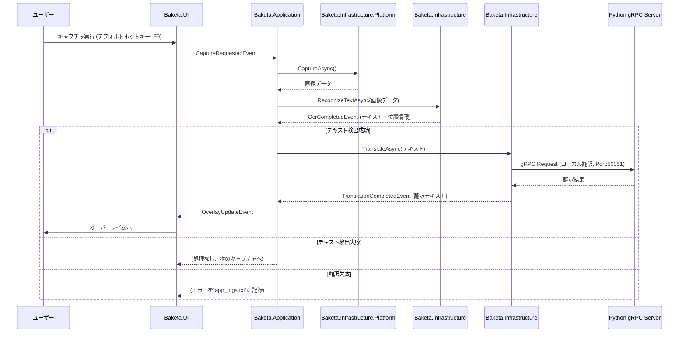
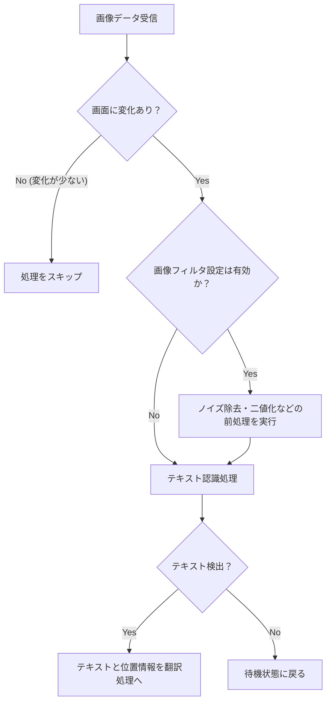
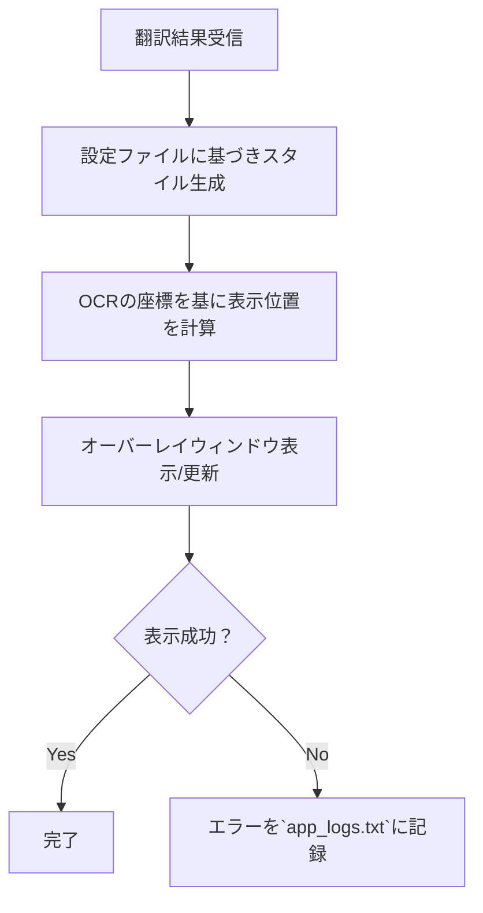

# Baketa QAテスト用簡易仕様書 (Alpha 0.1.4版)

**対象バージョン**: alpha-0.1.4
**最終更新日**: 2025-11-17

## 0. はじめに

### 0.1. 本書の目的

QA（品質保証）テスト担当者が、本アプリケーション「Baketa」のコア機能と仕様を理解し、テストケースの設計・実施を円滑に行うことを目的とする。本書は**Alpha 0.1.4版の実装に基づいた**内容であり、将来的な機能は別途記載する。

### 0.2. 現行バージョンの制約事項（QAテストの前提条件）

Alpha版である現行バージョンには、以下の制約が存在する。テスト実施前に環境がこれを満たしているか確認すること。

*   **Python環境について:**
    *   本アプリケーションは、翻訳処理のためにPythonで実装されたサーバーをバックグラウンドで実行する。
    *   **開発環境の場合**: Python 3.10.x が事前にインストールされ、実行パス（PATH）が通っている必要がある。また、`pip install -r grpc_server/requirements.txt` を実行し、必要なライブラリをインストールしておく必要がある。
    *   **リリース版の場合**: Python環境は `vendor/python/` ディレクトリに同梱されており、ユーザーが手動でインストールする必要はない。アプリケーションが自動的に同梱Python環境を使用する。
    *   *(注: Alpha 0.1.4では同梱Python環境の準備機能を実装済み。Beta版では.exe化を予定)*

*   **翻訳言語ペア:**
    *   **現在サポートされているのは日英翻訳のみ**（日本語→英語、英語→日本語）
    *   NLLB-200モデル自体は200言語に対応しているが、Alpha版では日英のみ動作確認済み

*   **ログファイルの確認:**
    *   UI上でユーザーに直接通知されないエラーの多くは、ログファイルに出力される。
    *   テスト中は、アプリケーションのルートディレクトリにある **`app_logs.txt`** を監視し、`[ERROR]` や `[WARNING]` レベルのログが出力されていないかを確認すること。

## 1. 全体機能フロー

アプリケーションの主要な処理とイベントの流れを以下に示す。



## 2. 機能仕様詳細

### 2.1. 画面キャプチャ機能 (`Capture`)

**目的:** ゲーム画面から画像を取得する。

**フロー図:**
```mermaid
graph TD
    A[キャプチャ要求] --> B{対象は現代的なゲームか？<br/>(DirectX/OpenGL)};
    B -- Yes --> C[Windows Graphics Capture API];
    B -- No --> D[GDI PrintWindow API (フォールバック)];
    C --> E{キャプチャ成功？};
    D --> E;
    E -- Yes --> F[画像データをOCR処理へ];
    E -- No --> G["エラーを`app_logs.txt`に記録しリトライ"];
```

**仕様詳細:**

| 条件 | 処理 | 備考 |
| --- | --- | --- |
| **キャプチャ方式** | | |
| DirectX/OpenGLを使用する現代的なゲーム | `WindowsGraphicsCapturer` を使用する。 | 高速でパフォーマンスが高い。 |
| 上記でキャプチャできない古いゲーム | `GdiWindowsCapturer` にフォールバックする。 | 互換性が高いが、若干低速。 |
| **異常系** | | |
| 対象ウィンドウが存在しない | 処理を中断し、ユーザーにウィンドウ選択を促すUIを表示する。 | |
| 画像データの取得に失敗 | `[ERROR] Capture failed...`等のメッセージを`app_logs.txt`に記録し、数秒後にリトライする。 | **UI通知なし。** |

---

### 2.2. OCR機能 (`OCR`)

**目的:** 画像データからテキスト情報を抽出する。

**フロー図:**


**仕様詳細:**

| 条件 | 処理 | 備考 |
| --- | --- | --- |
| **パフォーマンス最適化** | | |
| 前回の画像と比較し、差分が小さい | OCR処理をスキップする。 | CPU負荷を軽減。 |
| **画像前処理** | | |
| `OcrSettings:EnableFilters`が`true` | 複数のOpenCVフィルタ（ノイズ除去、二値化等）を適用する。 | OCRの認識精度向上を目的とする。 |
| **テキスト認識** | | |
| 画像内にテキストが検出された | `PaddleOcrEngine`がテキスト内容と座標を抽出し、`OcrCompletedEvent`を発行する。 | |
| テキストが検出されなかった | 処理を中断し、次のキャプチャを待つ。 | |
| OCRエンジンでエラー発生 | `[ERROR] OCR recognition failed...`等のメッセージを`app_logs.txt`に記録する。 | **UI通知なし。** |

---

### 2.3. 翻訳機能 (`Translation`)

**目的:** 抽出されたテキストを指定言語に翻訳する。

**フロー図:**
```mermaid
graph TD
    A[OCR結果受信] --> B{Pythonサーバーは起動中か？};
    B -- No --> C[Pythonサーバーを自動起動];
    B -- Yes --> D;
    C --> D[gRPC (Port:50051) で翻訳リクエスト];
    D --> E{翻訳成功？};
    E -- Yes --> F[翻訳結果をオーバーレイ処理へ];
    E -- No --> G["エラーを`app_logs.txt`に記録"];
```

**仕様詳細:**

| 条件 | 処理 | 備考 |
| --- | --- | --- |
| **ローカル翻訳 (NLLB-200)** | | |
| 常にローカル翻訳が選択される | `GrpcTranslationClient`を通じてPythonサーバーに翻訳をリクエストする。 | 高速でオフラインでも動作。日英翻訳のみサポート。 |
| Pythonサーバーが未起動 | `PythonServerManager`が同梱Python環境（`vendor/python/python.exe`）を優先使用して自動起動する。開発環境ではシステムPythonにフォールバック。 | 起動時のログも`app_logs.txt`で確認可能。 |
| **翻訳エンジン** | | |
| 単一エンジン使用 | Alpha 0.1.4では NLLB-200 エンジンのみを使用。フォールバック機能は存在しない。 | 将来的にGoogle Geminiなどクラウド翻訳の追加を計画中。 |
| **異常系** | | |
| 翻訳に失敗（接続失敗、タイムアウト等） | `[ERROR] Translation failed...`等のメッセージを`app_logs.txt`に記録する。 | **UI通知なし。** |

---

### 2.4. オーバーレイ表示機能 (`UI`)

**目的:** 翻訳結果をゲーム画面上に表示する。

**フロー図:**


**仕様詳細:**

| 条件 | 処理 | 備考 |
| --- | --- | --- |
| **スタイル生成** | | |
| アプリケーション起動時 | **`appsettings.json`** の`OverlaySettings`セクションからスタイル（フォント、色、透明度等）を読み込む。 | **注意:** 現バージョンでは、設定画面からの動的なスタイル変更機能は未実装。 |
| **表示位置** | | |
| 元のテキスト位置が利用可能 | `OverlayPositionManager`が元のテキストを覆い隠す、または隣接する最適な位置を計算する。 | |
| **異常系** | | |
| オーバーレイ表示に失敗 | `[ERROR] Failed to show overlay...`等のメッセージを`app_logs.txt`に記録する。 | **UI通知なし。** |

---

## 3. 将来的な機能（現行テスト対象外）

以下の機能はコードベースに痕跡があるが、現時点では有効化されておらず、QAテストの対象外とする。

| 機能 | 概要 | 備考 |
| --- | --- | --- |
| **クラウド翻訳 (Google Gemini)** | クラウドAI翻訳サービスによる高品質な翻訳。 | 将来的な機能として計画中。現時点では未実装のため、テスト対象外。 |
| **多言語対応** | 日英以外の言語ペア（中国語、韓国語など）のサポート。 | NLLB-200モデルは200言語対応だが、Alpha版では日英のみ動作確認済み。 |
| **翻訳エンジンのフォールバック** | ローカル翻訳失敗時のクラウド翻訳への自動切り替え。 | Alpha 0.1.4では単一エンジン使用のため、フォールバック機能は存在しない。 |
| **UIからのエラー通知** | OCRや翻訳の失敗をユーザーにトースト通知で知らせる機能。 | メソッドは存在するが、コア機能のエラーハンドリングからは呼び出されていない。設定画面での操作失敗時のみ使用される。 |
| **設定画面でのスタイル変更** | 設定画面のUIを操作して、オーバーレイの色や透明度を動的に変更する機能。 | ViewModelにプロパティは存在するが、UI（カラーピッカー等）が未実装。 |

---

## 4. Alpha 0.1.4の主要な変更点

### Python環境同梱戦略
- 同梱Python環境（`vendor/python/`）を優先使用
- システムPythonへのフォールバック（開発環境用）
- ユーザーがPythonをインストールする必要がなくなった（リリース版）

### 翻訳機能仕様の明確化
- 単一翻訳エンジン（NLLB-200）のみを使用
- フォールバック機能は存在しない
- 日英翻訳のみサポート（他の言語ペアは将来的に追加予定）

---

## 5. テスト実施時の注意事項

1. **ログ監視の徹底**
   - `app_logs.txt` を常に監視し、`[ERROR]`や`[WARNING]`レベルのログを見逃さないこと

2. **Python環境の確認**
   - 開発環境: システムPythonが正しくインストールされているか確認
   - リリース版: `vendor/python/python.exe` が存在することを確認

3. **翻訳言語ペアの制限**
   - 日英以外の言語ペアは動作確認されていないため、テスト対象外

4. **エラーハンドリングの検証**
   - UI通知がない場合でも、ログファイルでエラーが適切に記録されているか確認

---

**本ドキュメントは、Alpha 0.1.4版のQAテスト実施時に参照してください。**
