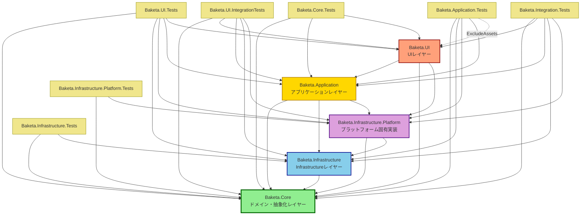

# Baketa プロジェクト依存関係グラフ

**作成日**: 2025-10-05
**Phase**: Phase 0.3 - 依存関係マッピング
**ツール**: dotnet sln list, ripgrep, 手動分析

---

## 📊 プロジェクト依存関係図

### Clean Architecture 5層構造



---

## 🏗️ 依存関係詳細

### 1. Baketa.Core（コアレイヤー）
**役割**: ドメインロジック、抽象化、インターフェース定義
**依存**: なし（最下層）

**特徴**:
- Clean Architectureの中心層
- 他のレイヤーから依存されるが、他のレイヤーに依存しない
- プラットフォーム非依存

---

### 2. Baketa.Infrastructure（Infrastructure実装層）
**役割**: OCR、翻訳、画像処理、外部サービス統合
**依存**:
- Baketa.Core

**提供機能**:
- PaddleOCR PP-OCRv5統合
- NLLB-200翻訳エンジン
- OpenCvSharp画像処理
- Supabase統合
- ONNX Runtime（GPU/DirectML対応）

---

### 3. Baketa.Infrastructure.Platform（プラットフォーム固有実装）
**役割**: Windows特化機能、ネイティブライブラリ連携
**依存**:
- Baketa.Core
- Baketa.Infrastructure

**提供機能**:
- Windows Graphics Capture API（BaketaCaptureNative.dll P/Invoke）
- GDI画面キャプチャ
- SharpDX連携（WinRTWindowCapture）
- Windows Performance Counter

---

### 4. Baketa.Application（アプリケーションレイヤー）
**役割**: ビジネスロジック、サービス統合、イベント処理
**依存**:
- Baketa.Core
- Baketa.Infrastructure
- Baketa.Infrastructure.Platform

**提供機能**:
- キャプチャサービス統合
- 翻訳オーケストレーション
- イベント駆動アーキテクチャ（EventAggregator）
- StreamingTranslationService

---

### 5. Baketa.UI（UIレイヤー）
**役割**: ユーザーインターフェース、オーバーレイ表示
**依存**:
- Baketa.Application
- Baketa.Core
- Baketa.Infrastructure.Platform

**技術スタック**:
- Avalonia 11.2.7（クロスプラットフォームUI）
- ReactiveUI 20.1.63（MVVM、リアクティブプログラミング）
- Avalonia.Themes.Fluent（Modern UI）

---

## ✅ Clean Architecture準拠確認

### 依存方向の検証

```
UI → Application → Infrastructure → Core
                         ↓
                    Infrastructure.Platform → Core
```

**検証結果**:
- ✅ **Core層**: 外部依存なし（最下層）
- ✅ **Infrastructure層**: Core層のみ依存
- ✅ **Infrastructure.Platform層**: Core + Infrastructure依存
- ✅ **Application層**: Core + Infrastructure + Infrastructure.Platform依存
- ✅ **UI層**: Application + Core + Infrastructure.Platform依存

**結論**:
- ❌ **循環依存なし**（dependency_analysis.mdで確認済み）
- ✅ **依存方向**: 外側 → 内側（Clean Architecture準拠）
- ✅ **レイヤー分離**: 明確

---

## 🧪 テストプロジェクト依存関係

### テスト戦略

| テストプロジェクト | 対象レイヤー | 依存プロジェクト | テストタイプ |
|-------------------|-------------|-----------------|-------------|
| Baketa.Core.Tests | Core | Core, Application, UI | 単体テスト |
| Baketa.Infrastructure.Tests | Infrastructure | Core, Infrastructure | 単体テスト |
| Baketa.Infrastructure.Platform.Tests | Infrastructure.Platform | Core, Infrastructure.Platform | 単体テスト |
| Baketa.Application.Tests | Application | Core, Infrastructure, Platform, Application, UI（ExcludeAssets） | 単体テスト |
| Baketa.UI.Tests | UI | Core, Infrastructure, Platform, Application, UI | 単体テスト |
| Baketa.UI.IntegrationTests | UI | すべて | 統合テスト |
| Baketa.Integration.Tests | 全体 | すべて | 統合テスト |

**テストカバレッジ**: 1,300+テストケース

---

## 📦 除外プロジェクト（ソリューション外）

以下のプロジェクトはBaketa.slnに含まれていません:

- `PriorityTranslationTest` - 優先度翻訳テスト（実験用）
- `test_phase41` - Phase 4.1テストプロジェクト（実験用）
- `DiagnosticTest` - 診断テスト（デバッグ用）
- `ConnectionPoolDemo` - 接続プールデモ（検証用）

**理由**: 実験用・デバッグ用プロジェクトとして独立

---

## 📊 プロジェクト統計

### 本番プロジェクト

| プロジェクト | 役割 | 依存数 |
|-------------|------|--------|
| Baketa.Core | ドメイン・抽象化 | 0 |
| Baketa.Infrastructure | Infrastructure実装 | 1（Core） |
| Baketa.Infrastructure.Platform | プラットフォーム固有 | 2（Core, Infrastructure） |
| Baketa.Application | アプリケーション | 3（Core, Infrastructure, Platform） |
| Baketa.UI | ユーザーインターフェース | 3（Application, Core, Platform） |

### テストプロジェクト

| プロジェクト | 依存数 |
|-------------|--------|
| Baketa.Core.Tests | 3 |
| Baketa.Infrastructure.Tests | 2 |
| Baketa.Infrastructure.Platform.Tests | 2 |
| Baketa.Application.Tests | 5 |
| Baketa.UI.Tests | 5 |
| Baketa.UI.IntegrationTests | 5 |
| Baketa.Integration.Tests | 5 |

---

## 🔍 重要な発見

### 1. Clean Architecture完全準拠
- 循環依存なし
- 依存方向は外側→内側
- Core層は完全独立

### 2. テストカバレッジ充実
- 全レイヤーに対応する単体テストプロジェクト
- 2つの統合テストプロジェクト（UI、全体）
- 1,300+テストケース

### 3. プラットフォーム分離良好
- Platform固有機能はInfrastructure.Platformに集約
- Core/Infrastructure層はプラットフォーム非依存

### 4. UI層の依存関係
- UIはApplicationレイヤーを経由して機能にアクセス
- 直接Infrastructure層に依存しない（Infrastructure.Platformのみ）

---

## 次のステップ

Phase 0.3完了後:
- Phase 2: gRPC基盤構築
  - Google.Protobuf使用開始（現在未使用）
  - Grpc.Net.Client追加予定
  - OptimizedPythonTranslationEngine（2,765行）削除可能化
